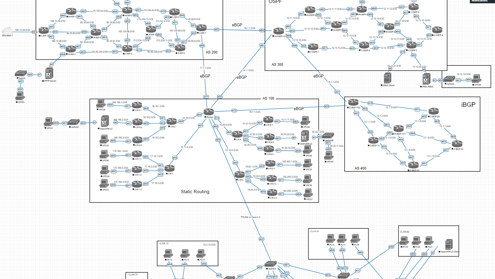

# Лабораторная работа №4  - Динамическая маршрутизация. Протокол BGP

* [Все лабораторные работы по сетям и системам передачи данных](./README.md)
* [Предыдущая лабораторная работа - Динамическая маршрутизация. Протоколы RIP и OSPF](./RIP,%20OSPF.md)
* [Следующая лабораторная работа - SSH, NAT](./SSH,%20NAT.md)

---

 **BGP** (англ. Border Gateway Protocol, протокол граничного шлюза) - протокол динамической маршрутизации, относится к классу протоколов маршрутизации внешнего шлюза (англ. EGP — External Gateway Protocol), на текущий момент является основным протоколом динамической маршрутизации в сети Интернет.

[Подробнее о работе протокола в статье](https://habr.com/ru/post/450814/)



## Настройка BGP на CISCO

```
router bgp 400
bgp log-neighbor-changes
network 13.1.1.0 mask 255.255.255.0
network 13.1.2.0 mask 255.255.255.0
network 13.1.3.0 mask 255.255.255.0
network 15.1.1.0 mask 255.255.255.0
network 16.1.1.0 mask 255.255.255.0
redistribute connected
neighbor 13.1.1.15 remote-as 400
neighbor 13.1.1.15 route-reflector-client
neighbor 13.1.1.15 next-hop-self
neighbor 13.1.2.101 remote-as 400
neighbor 13.1.2.101 route-reflector-client
neighbor 13.1.2.101 next-hop-self
neighbor 13.1.3.28 remote-as 400
neighbor 13.1.3.28 route-reflector-client
neighbor 13.1.3.28 next-hop-self
neighbor 15.1.1.10 remote-as 300
neighbor 16.1.1.100 remote-as 100
```

## Настройка BGP на Microtik

```
/interface bridge
add name=loopback
/routing bgp instance
add as=400 name=BGP400 redistribute-connected=yes router-id=10.255.255.102
/ip address
add address=10.255.255.102 interface=loopback network=10.255.255.102
/routing bgp peer
add instance=BGP400 name=peer1 nexthop-choice=force-self remote-address=\
13.1.2.102 remote-as=400 route-reflect=yes
add instance=BGP400 name=peer2 nexthop-choice=force-self remote-address=\
13.1.5.15 remote-as=400 route-reflect=yes
add instance=BGP400 name=peer3 nexthop-choice=force-self remote-address=\
13.1.8.23 remote-as=400 route-reflect=yes
add instance=BGP400 name=peer4 nexthop-choice=force-self remote-address=\
13.1.9.33 remote-as=400 route-reflect=yes
add instance=BGP400 name=peer5 nexthop-choice=force-self remote-address=\
13.1.6.28 remote-as=400 route-reflect=yes
```
