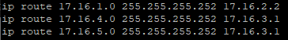

# Лабораторная работа №2 - GRE

[**Все лабораторные работы по сетям и системам передачи данных**](./README.md)

**GRE** (Generic Routing Encapsulation — общая инкапсуляция маршрутов) — протокол туннелирования сетевых пакетов, разработанный компанией CISCO Systems. Его основное назначение — инкапсуляция пакетов сетевого уровня сетевой модели OSI в IP пакеты.

# 1 вариант

## Построение топологии

Имеем:
* 4 Cisco роутера со стандартными настройками
* 2 Linux Debian


## Статическая маршрутизация

### C-GRE-1

#### Интерфейсы


#### Static Routing


### C-R-1

#### Интерфейсы


#### Static Routing


### C-R-2

#### Интерфейсы


#### Static Routing


### C-GRE-2

#### Интерфейсы


#### Static Routing


## GRE
### C-GRE-1


### C-GRE-2


## Добавление Linux

### Linux16
В `nano /etc/network/interfaces` пишем:

```
auto ens3
allow-hotplug ens3
iface ens3 inet static
      address 17.16.1.1
      gateway 17.16.1.2
```
сохраняемся и обязательно делаем `reboot`.

### Linux17
В `nano /etc/network/interfaces` пишем:

```
auto ens3
allow-hotplug ens3
iface ens3 inet static
      address 17.16.5.1
      gateway 17.16.5.2
```

сохраняемся и обязательно делаем `reboot`.

Пинг появился но не по GRE, для этого мы исправим маршруты на **C-GRE-1** и **C-GRE-2**.

### C-GRE-1
Удаляем предыдущий 

`no ip route 17.16.5.0 255.255.255.252 17.16.2.1`

Добавляем

`ip route 17.16.5.0 255.255.255.252 172.16.1.2`

### C-GRE-2
Удаляем предыдущий 

`no ip route 17.16.1.0 255.255.255.252 17.16.4.2`

Добавляем

`ip route 17.16.1.0 255.255.255.252 172.16.1.1`


# 2 Вариант

## Построение топологии

Имеем:
* 3 Cisco роутера со стандартными настройками
* 1 MikroTik 6.47 (только на этой версии работает GRE)
* 2 Linux Debian


## Статическая маршрутизация

### C-GRE-1

#### Интерфейсы


#### Static Routing


### C-R-1

#### Интерфейсы


#### Static Routing


### C-R-2

#### Интерфейсы


#### Static Routing


### M-GRE-2

`/system identity set name=M-GRE-2`

#### Интерфейсы

```
/ip address
add address=17.16.5.2/30 interface=ether1 network=17.16.5.0
add address=17.16.4.2/30 interface=ether2 network=17.16.4.0
```

#### Static Routing

```
/ip route
add distance=1 dst-address=17.16.1.0/30 gateway=17.16.4.1
add distance=1 dst-address=17.16.2.0/30 gateway=17.16.4.1
add distance=1 dst-address=17.16.3.0/30 gateway=17.16.4.1
```

## GRE

### C-GRE-1

```
interface Tunnel1
ip address 172.16.1.1 255.255.255.0
ip mtu 1400
ip tcp adjust-mss 1360
tunnel source 17.16.2.2
tunnel destination 17.16.4.2
```


### M-GRE-2
```
/interface gre
add name=Tunnel1 remote-address=17.16.2.2
/ip address
add address=172.16.1.1/24 interface=Tunnel1
```

# 3 Вариант

## Построение топологии

Имеем:
* 2 Cisco роутера со стандартными настройками
* 4 Linux Kali


## Статическая маршрутизация

### LinuxKali-1

```
allow-hotplug eth1
iface eth1 inet static
address 17.16.2.2  
netmask 255.255.255.252
network 17.16.2.0
broadcast 17.16.2.3
gateway 17.16.2.1
dns-nameservers 17.16.2.1
```

### C-R-1

#### Интерфейсы

```
interface Ethernet0/0
description 'Linux27'
ip address 17.16.2.1 255.255.255.252
no sh

interface Ethernet0/1
description 'C-R-2'
ip address 17.16.3.1 255.255.255.252
no sh
```


#### Static Routing

```
ip route 17.16.1.0 255.255.255.252 17.16.2.2
ip route 17.16.4.0 255.255.255.252 17.16.3.2
ip route 17.16.5.0 255.255.255.252 17.16.3.2
```


### C-R-2

#### Интерфейсы

```
interface Ethernet0/0
description 'Linux29'
ip address 17.16.4.1 255.255.255.252
no sh

interface Ethernet0/2
description 'C-R-1'
ip address 17.16.3.2 255.255.255.252
no sh
```


#### Static Routing

```
ip route 17.16.1.0 255.255.255.252 17.16.3.1
ip route 17.16.2.0 255.255.255.252 17.16.3.1
ip route 17.16.5.0 255.255.255.252 17.16.4.2
```


3 вариант находится в процессе доработки.

# Полезные ссылки:

* [**Как настроить GRE туннель (CISCO)**](https://community.cisco.com/t5/%D0%B1%D0%B5%D0%B7%D0%BE%D0%BF%D0%B0%D1%81%D0%BD%D0%BE%D1%81%D1%82%D1%8C-%D0%B4%D0%BE%D0%BA%D1%83%D0%BC%D0%B5%D0%BD%D1%82%D1%8B-security/%D0%BA%D0%B0%D0%BA-%D0%BD%D0%B0%D1%81%D1%82%D1%80%D0%BE%D0%B8%D1%82%D1%8C-gre-%D1%82%D1%83%D0%BD%D0%BD%D0%B5%D0%BB%D1%8C/ta-p/3145690)
* [**VPN:GRE и IPsec (быстрая настройка, аутентификация с помощью пароля) (MikroTik)**](https://mikrotik.wiki/wiki/VPN:GRE_%D0%B8_IPsec_\(%D0%B1%D1%8B%D1%81%D1%82%D1%80%D0%B0%D1%8F_%D0%BD%D0%B0%D1%81%D1%82%D1%80%D0%BE%D0%B9%D0%BA%D0%B0,_%D0%B0%D1%83%D1%82%D0%B5%D0%BD%D1%82%D0%B8%D1%84%D0%B8%D0%BA%D0%B0%D1%86%D0%B8%D1%8F_%D1%81_%D0%BF%D0%BE%D0%BC%D0%BE%D1%89%D1%8C%D1%8E_%D0%BF%D0%B0%D1%80%D0%BE%D0%BB%D1%8F\)#.D0.9D.D0.B0.D1.81.D1.82.D1.80.D0.BE.D0.B9.D0.BA.D0.B0_.D0.BF.D0.B5.D1.80.D0.B2.D0.BE.D0.B3.D0.BE_.D0.BC.D0.B0.D1.80.D1.88.D1.80.D1.83.D1.82.D0.B8.D0.B7.D0.B0.D1.82.D0.BE.D1.80.D0.B0)
* [**Канал между linux и cisco (GRE) - всё руками (форум)**](https://forum.cz6.ru/viewtopic.php?t=152)
* [**Видеоуроки "Linux для начинающих**](https://www.youtube.com/watch?v=fTtr1t7uWvU&list=PLcDkQ2Au8aVNMLee8b3RN1QXX0ZBZOYJV&index=5)

