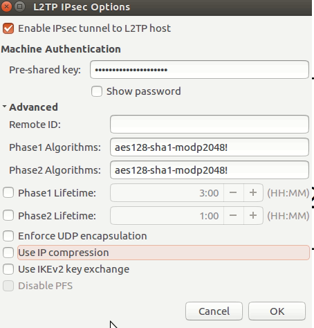

# Лабораторные работы №4-5 - L2TP и L2TP over IPsec

[**Все лабораторные работы по сетям и системам передачи данных**](./README.md)

### Содержание

- [Теоретическое введение](#теоретическое-введение)
  - [L2TP](#l2tp)
  - [IPsec](#ipsec)
- [Настройка на Cisco](#настройка-на-cisco)
  - [Подготовка стенда](#подготовка-стенда)
  - [Настройка L2TP](#настройка-l2tp)
    - [Настройка L2TP на сервере](#настройка-l2tp-на-сервере)
    - [Настройка L2TP на клиенте](#настройка-l2tp-на-клиенте)
  - [Настройка IPsec](#настройка-ipsec)
    - [Настройка IPsec на сервере](#настройка-ipsec-на-сервере)
    - [Настройка IPsec подразделения](#настройка-ipsec-подразделения)
- [Настройка на Linux](#настройка-на-linux)
    - [1. Топология](#1-топология)
    - [2. Устройства](#2-устройства)
    - [3. Подготовка топологии к настройке](#3-подготовка-топологии-к-настройке)
    - [4. Настройка L2TP и IPSec на сервере](#4-настройка-l2tp-и-ipsec-на-сервере)
    - [5. Настройка L2TP и IPSec на клиенте](#5-настройка-l2tp-и-ipsec-на-клиенте)


# Теоретическое введение 

## L2TP 

**Layer 2 Tunneling Protocol (L2TP)** был впервые предложен в 1999 году в качестве обновления протоколов L2F (Cisco) и  PPTP (Microsoft). Поскольку L2TP сам по себе не обеспечивает шифрование или аутентификацию, часто с ним используется IPsec. L2TP в паре с IPsec поддерживается многими операционными системами, стандартизирован в RFC 3193. L2TP/IPsec считается безопасным и не имеет серьезных выявленных проблем (гораздо безопаснее, чем PPTP). L2TP/IPsec может использовать шифрование 3DES или AES, хотя, учитывая, что 3DES в настоящее время считается слабым шифром, он используется редко. У протокола L2TP иногда возникают проблемы из-за использования по умолчанию UDP-порта 500, который, как известно, блокируется некоторыми брандмауэрами. Протокол L2TP/IPsec позволяет обеспечить высокую безопасность передаваемых данных, прост в настройке и поддерживается всеми современными операционными системами. Однако L2TP/IPsec инкапсулирует передаваемые данные дважды, что делает его менее эффективным и более медленным, чем другие VPN-протоколы.

**LNS (L2TP Network Server)** - сервер доступа к локальной сети.  
**LAC (L2TP Access Concentrator)** - устройство для прозрачного подключения пользователя к серверу (клиент дозванивается до LAC, LAC прокладывает тунель к LNS c ppp соединением). Иногда LAC сам выступает в роли клиента. В лабораторной мы рассмотрим этот случай.

Выше представлены фрагменты статьи c Хабра.  
[Полную статью можно посмотреть здесь.](https://habr.com/ru/company/dsec/blog/499718/)

## IPsec

**Internet Protocol Security (IPsec)** — это набор протоколов для обеспечения защиты данных, передаваемых по IP-сети. В отличие от SSL, который работает на прикладном уровне, IPsec работает на сетевом уровне и может использоваться нативно со многими операционными системами, что позволяет использовать его без сторонних приложений (в отличие от OpenVPN). IPsec стал очень популярным протоколом для использования в паре с L2TP или IKEv2.

# Настройка на Cisco

[**Полезный видеоурок по настроке L2TP c IPsec на Cisco**](https://youtu.be/N8qoleHxNmA)

## Подготовка стенда


Пропускаю описание базовой настройки роутеров Cisco. Там как обычно нужно поменять `hostname` и настроить интерфейсы.

## Настройка L2TP

### Настройка L2TP на сервере

```
conf t
aaa new-model
aaa authentication ppp L2TP-AUTH local
user unit2 password 0 secret1
user unit3 password 0 secret2
vpdn enable
vpdn-group 1
accept-dialin
protocol l2tp
virtual-template 1
ex
no l2tp tunnel authentication
lcp renegotiation always
ip pmtu
ex
int lo 0
ip add 172.16.1.1 255.255.255.0
ex
int virtual-template 1
ip unnumberd lo0
peer default ip address pool  POOL-L2TP
ppp authentication ms-chap-v2 L2TP-AUTH
ip mtu 1406
ip tcp adjust-mss 1366
ex
ip local pool POOL-L2TP 172.16.1.10 172.16.1.20
ex
wr
```

**Разберём каждую строчку отдельно:**

Включение аутентификации по ppp на устройстве

```
aaa new-model
aaa authentication ppp L2TP-AUTH local
```

Создание пользователей для ppp-сессий

```
user unit2 password 0 secret1
user unit3 password 0 secret2
``` 

* `vpdn enable` - включаем VPDN (Virtual Private Direct Network)
* `vpdn-group 1` - создаём группу  с настройками VPDN подключения 
* `accept-dialin`  - означает, что мы будем принимать звонки (выполнять роль сервера)
* `protocol l2tp` - устанавливаем протокол 
* `virtual-template 1` - устанавливаем шаблон подключения 
* `no l2tp tunnel authentication` - отключаем аутентификацию по протоколу L2TP 
* `lcp renegotiation always`- разрешаем серверу переподключаться 
* `ip pmtu` - подключаем pass mtu, служит для сигналиации подключения в случае, если пакеты слишком большие

Создаем loopback для virtual template

```
int lo 0
ip add 172.16.1.1 255.255.255.0
ex
int virtual-template 1
ip unnumberd lo0
```

* `peer default ip address pool  POOL-L2TP` - назначаем пул адресов для клиентов

Укажим параметры mtu и mss для того, чтобы пактеты не дефрагментировались из-за заголовков L2TP и IPsec.

```
ip mtu 1406
ip tcp adjust-mss 1366
```

* `ip local pool POOL-L2TP 172.16.1.10 172.16.1.20` создаём пул адресов для клиентов

### Настройка L2TP на клиенте

```
pseudowire-class PW-CLASS
encapsulation l2tpv2
ip local interface e0/0
ip pmtu
ex
int virtual-ppP 1
ip address negotiated
ppp authentcation ms-chap-v2 callin
ppp direction callout
ppp chap hostname unit2
ppp chap password 0 secret1
psewd
ip mtu 1406
ip tcp adjust-mss 1366
pseudowire 2.2.2.2 1 pw-class PW-CLASS
end
wr
```

**Разберём каждую строчку отдельно:**

* `pseudowire-class PW-CLASS` - создаём шаблон для тунеля
* `encapsulation l2tpv2` - указываем инкапсуляцию тунеля
* `ip local interface e0/0` - указыаем интерфейс, на котором будет создан тунель
* `ip address negotiated` - автоматическое получение адреса

По умолчанию `ms-chap` позволяет выполнять только двухстороннюю аутентификацию, но благодаря следующим настройкам:

```
ppp authentcation ms-chap-v2 callin
ppp direction callout
```

мы добавляем возможность производить односторонюю аутентификацию.

* `ppp chap hostname unit2` - указываем имя при подключении, по умолчанию используется имя хоста
* `pseudowire 2.2.2.2 1 pw-class PW-CLASS`- адрес сервера для соединения


Для проверки правильности настройки:

```
sh ip int br
ping 172.16.1.1
sh vpdn
sh l2tp session
```

## Настройка IPsec

### Настройка IPsec на сервере

Создаём политики ipsec

```
crypto isakmp policy 1
encr aes 128
authentication pre-share
group 5
hash sha
ex
```

Авторизация по ключу. Нули в адресе записаны потому, что мы хотим, чтобы пиры подключались откуда угодно.

```
crypto keyring KER-L2TP
pre-shared-key address 0.0.0.0 0.0.0.0 key secret
ex
```

Создаём профиль isakmp для первой фазы.

```
crypto isakmp profile IKE-PROF-L2TP
keyring KER-L2TP
match identity address 0.0.0.0
!
ex
```

Создаём transform-set для второй  фазы.
Mode `transport`, так как у нас L2TP тунель.

```
$c transform-set TRANS-L2TP esp-aes 128 esp-sha-hmac
mode transport
ex
```

Создаём динамическую криптокарту, чтобы обеспечить работу с изменяющимися пирами.
```
crypto dynamic-map DYN-MAP-L2TP 1
set isakmp-profile IKE-PROF-L2TP
set transform-set TRANS-L2TP
ex
```

Указываем isakmp профиль transform set. Так как динамическую карту нельзя применить к интерфейсу, укажем дополнительно статическую карту.
```
crypto map CR-MAP-L2TP 1 ipsec-isakmp dynamic DYN-MAP-L2TP
int e0/0
crypto map CR-MAP-L2TP
ex
wr
```

### Настройка IPsec подразделения

Создаём политики.
```
conf t
crypto isakmp policy 1
encr aes 128
authentication pre-share
group 5
hash sha
ex
```

Создаём keyring с pre-shared ключом.
```
crypto keyring KER-L2TP
pre-shared-key address 2.2.2.2 key secret
ex
```

Создаём профиль isakmp с identity
```
crypto isakmp profile IKE-PROF-HQ
keyring KER-HQ
match identity address 2.2.2.2
!
ex
```

Создаём transform-set, также в транспортном режиме.
```
$c transform-set TRANS-HQ esp-aes 128 esp-sha-hmac
mode transport
ex
```

Создаём статическую криптокарту с внешним адресом главного офиса.
```
crypto map CR-MAP-HQ 1 ipsec-isakmp 
set isakmp-profile IKE-PROF-HQ
set transform-set TRANS-HQ
match address VPN-HQ
peer
set peer 2.2.2.2
ex
```

Создаём access list с шифрованием трафика. L2TP работает поверх UDP.
```
ip access-list extended VPN-HQ
permit udp host 1.1.1.2 eq 1701 host 2.2.2.2 eq 1701
ex
```

Применим криптокарту к внешнему интерфейсу.
```
int e0/0
crypto map CR-MAP-HQ
end
```

Переустановка тунеля.
```
clear l2tp all
wr
```

Для проверки:

```
sh crypto isakmp sa
sh crypto ipsec sa
sh ip route
ping 172.16.1.1 
```

Аналогично для других подразделений.

***

# Настройка на Linux

### 1. Топология


***

### 2. Устройства

  - Выход в интернет
  - Linux: linux-ubuntu-server-16.04, Ehthernets: 1 Количество: 1шт
  - Linux: linux-ubuntu-desktop-16.04, Ehthernets: 1 Количество: 1шт
  
***

### 3. Подготовка топологии к настройке

Для начала настроим L2TP-Server, подключив их к интернету. Для этого изменим настройки интерфейсов:
  ```
  nano /etc/network/interfaces
  ```
  
  
  
И обновим машину:

  ```
  sudo apt-get update
  ```
  
А так же установим на L2TP-Client необходимые пакеты через терминал:

  ```
  sudo add-apt-repository ppa:nm-l2tp/network-manager-l2tp
  sudo apt-get update
  sudo apt-get install network-manager-l2tp network-manager-l2tp-gnome
  ```
  
***

### 4. Настройка L2TP и IPSec на сервере

Перейдем к настройке L2TP сервера. Для этого воспользуемся скриптом. Скачаем его на на L2TP-Server с помощью команды:

  ```
  wget https://git.io/vpnsetup -O vpnsetup.sh
  ```
  
  Затем отредактируем скачанный скрипт:
  
  ```
  nano vpnsetup.sh
  ```
  
  Придуем некоторый Pre-Shared key для шифрования (не менее 20 символов), а так же логин и пароль для клиента:
  
  
  
  Затем запустим выполнение данного скрипта. Он настроит сразу и L2TP и IPSec.
  
  ```
  sh vpnsetup.sh
  ```
  
  После выполнения скрипта перезапускаем машину:
  
  ```
  reboot
  ```
  
  После перезагрузки должен подняться интерфейс ppp0. Проверим командой:
  
  ```
  ip a
  ```
  
  
  
  ***
  
### 5. Настройка L2TP и IPSec на клиенте
  
  Теперь переходим к настройке L2TP-Client. Заходим в сетевые настройки и добавляем новое подключение. Далее выбираем vpn, затем L2TP. После этого вводим
  требуемую информацию:
  
  
  
  Затем переходим в настройки IPSec, вводим Pre-shared key и дополнительные настройки шифрования:
  
  
  
  После чего сохраняем все настройки, активируем соединение и ждем до появления уведомления об удачном подключении.
  Можем проверить, что выход в интернет теперь идет через VPN:
  
  
