# Практическая работа №2. Настройка и конфигурация Linux-систем и прав доступа на базе Debian 11.


## Используемый стек
- [VMware Workstation](https://store-eu.vmware.com/vmware-workstation-16-pro-5434558400.html)
- [Операционная система Linux Debian 11 консольная](https://www.debian.org)

## Задание

1. Установить Debian 11.
2. Создать snapshot.
3. Включить пользователя в группу sudo.
4. Выделить место на VMware под новый HDD.
5. Создать 2 новыx HDD.  
   5.1.Необходимо примонтировать 1 диск как файловую систему только для чтения.  
   5.2.Примонтировать 2 диск стандартно.
6. Создать директорию “Data”, bigData.
7. Примонтировать первый новый HDD в Linux системе к вновь созданной директории “bigData”
8. Примонтировать второй новый HDD в Linux системе к вновь созданной директории “Data”
9. Примонтировать одну папку в другую, для этого используйте опцию --bind.
10. Создать новую группу “mirea”.
11. Создать папку “23” в директории “Data”.
12. Назначить на данную папку “23” группу “mirea”.
13.  Создать нового пользователя.
14. Назначить пароль.
15. Включить нового пользователя в группу “mirea”.
16. Убедиться, что в домашнем каталоге создана директория с новым пользователем.
17. Назначить права доступа для нового пользователя, таким образом на директорию “Data”, чтобы результат работы команды ls был отрицательным, пояснить вывод команды ls.
18. Залогиниться новым пользователем в Linux, проверить работу 16 пункта.
19. Установить SSH-сервер (сменить стандартный порт на любой другой) продемонстрировать подключение с linux на linux.
20. Установка и настройка сервера SSH в Linux
21. Подключиться из Windows (основная операционная система, у кого-то может быть и MAC, по поводу установки PuTTY на MAC есть статья) на виртуальную машинку Linux по SSH с помощью PuTTY Установка и настройка Putty
22. Настроить SFTP. Практическая работа по настройке SFTP
23. Проверить работу после перезапуска системы, что все настройки сохранились.


## Выполнение

### Установка Debian 11

[Ссылка на установочный образ](https://www.debian.org/download)

Во время установки необходимо убрать отметку об установке графического окружения.

### Включение пользователя в группу sudo.
Вводим `su`, затем вводим пароль.  

Далее 
```
apt install sudo
su -
usermod -aG sudo <username>
```

### Выделение диска

В первую очередь создаем диск в vmware. 

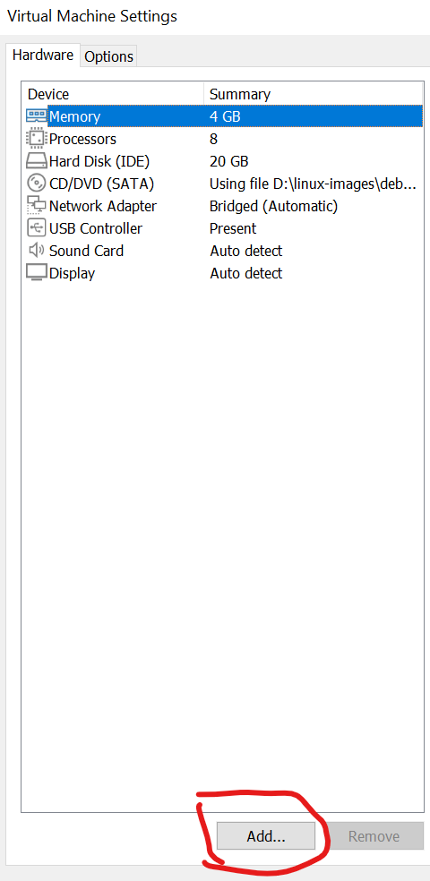

Посмотрим, что мы имеем до всех настроек. Для этого посмотрим список дисков

```
fdisk -l
```
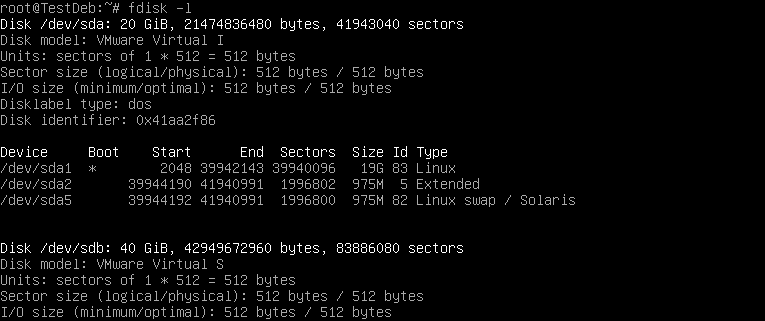

Отлично! Теперь начинаем выполнение задания. Для начала создадим папку в корне машины и примонтируем в нее диск

```
# Создаем дириктории
sudo mkdir /bigdata/
sudo mkdir /data/

# Делаем разметку дисков
sudo mkfs.ext4 /dev/sdb
sudo mkfs.ext4 /dev/sdc

# Монтируем диск в нашу папки
sudo mount -r /dev/sdb /bigdata
sudo mount /dev/sdc /data

# Монтируем одну папку в другую
 sudo mount --bind /data/ /bigdata/

# Проверяем, что диски успешно примонтированы
df -h
```
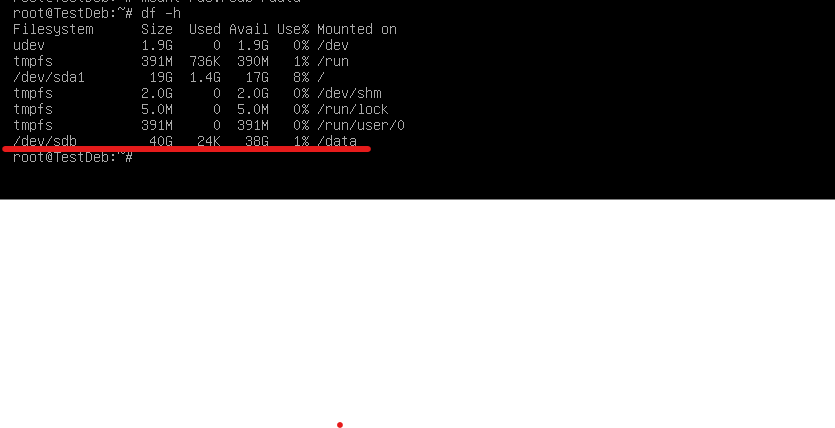

Теперь нам нужно сделать так, чтобы при перезапуске системы диск оставался примонтированным в папку /data. Для этого нужно внести настройки в файлик /etc/fstab

```
sudo echo  “/dev/sdb /data ext4 defaults 0 0" >> /etc/fstab	
```

### Создание группы и пользователя, изменение прав доступа

Для начала создаем группу "mirea"

```
sudo groupadd mirea
```

Теперь создадим папку "23" и назначим ее на групу mirea

```
# Создаем папку
sudo mkdir /data/23
# Изменяем группу
sudo chgrp mirea /data/23
```

Создаем пользователя

```
# Создать пользователя -m - создать домашню дирикторию -s - задать рабочую оболочку
sudo useradd -m -s /bin/bash valera 
# Задать пароль пользователю
sudo passwd valera
# Добавить пользователя в группу
sudo usermod valera -aG mirea
# Проверить наличие необходимой папки в домашней дириктории
ls -la /home/
# Изменяем права доступа в папку /data для отрицательного вывода ls. 700 - полные права у хозяина и никаких прав у остальных пользователей
sudo chmod 700 data 
```

#### Домашняя дириктория

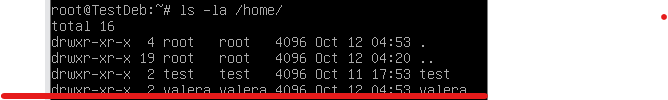


#### Вывод ls

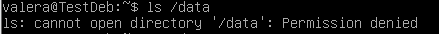


### SSH

**SSH** (англ. Secure Shell — «безопасная оболочка») — сетевой протокол прикладного уровня, позволяющий производить удалённое управление операционной системой и туннелирование TCP-соединений (например, для передачи файлов). Схож по функциональности с протоколами Telnet и rlogin, но, в отличие от них, шифрует весь трафик, включая и передаваемые пароли. SSH допускает выбор различных алгоритмов шифрования. SSH-клиенты и SSH-серверы доступны для большинства сетевых операционных систем.

[Ссылка на другую лабораторную работу на эту тему](SSH,%20NAT.md#SSH)

Для начала установим ssh сервер:

```
sudo apt update && sudo apt install -y ssh
```

Теперь нам нужно отредактировать конфиг ssh для дальнейшего использования, для этого зайдем в настройки конфигурации, сменим порт, разрешим только ipv4 семейство адресов и логин root пользователя

```
sudo nano /etc/ssh/sshd_config
```

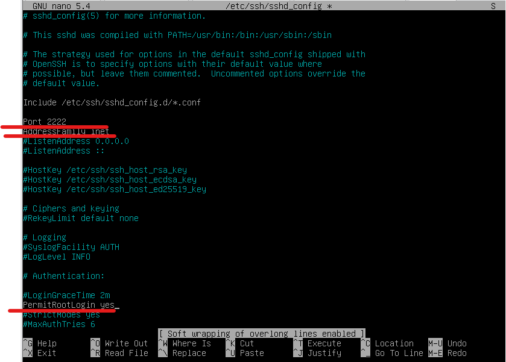

SSH сервер готов, применяем настройки и попробуем подключиться на него с другой linux машины и с основной системы через putty

```
sudo systemctl restart ssh
```

#### Linux to Linux

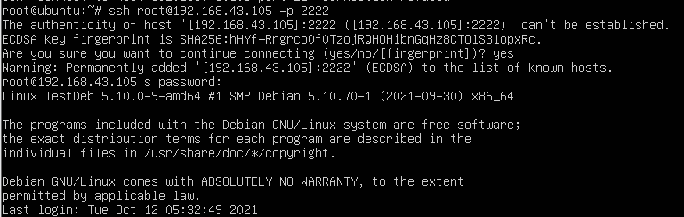


#### Putty

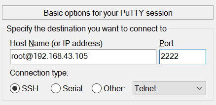

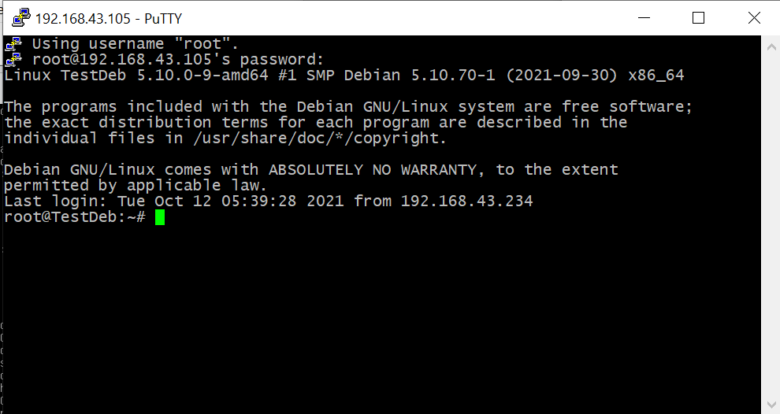

### SFTP

**SFTP (англ. SSH File Transfer Protocol)** — протокол прикладного уровня, предназначенный для копирования и выполнения других операций с файлами поверх надёжного и безопасного соединения. Протокол разработан группой IETF как расширение к SSH-2, однако SFTP допускает реализацию и с использованием иных протоколов сеансового уровня.

Настроим коннект по SFTP. Для этого скорректируем настройки нашего SSH сервера

```
sudo nano /etc/ssh/sshd_config
```

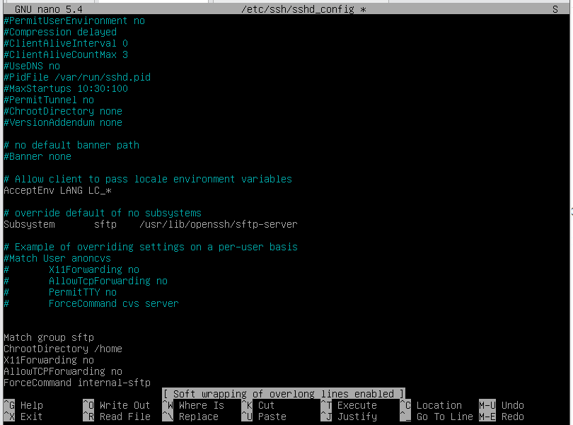

```
sudo systemctl restart ssh
```

Теперь создадим пользователя sftpuser и зададим ему соответствующую группу

```
groupadd sftp
useradd -m -s /bin/bash sftpuser
passwd sftpuser
usermod -aG sftp sftpuser
```

Пробуем подключиться с другого линукса и с помощью winscp:

#### Linux to Linux

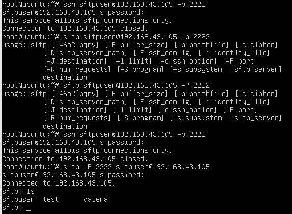

#### WinSCP

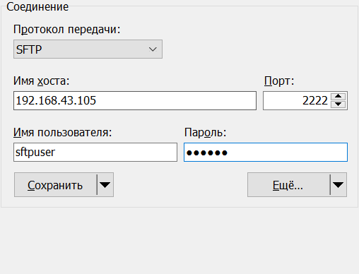


## Дополнительные материалы

- Установка и настройка сервера SSH в Linux | https://hackmd.io/@IgorLitvin/Hkz5b78MY
- Установка и настройка Putty | https://hackmd.io/@IgorLitvin/BJm5SfIMK
- Практическая работа по настройке SFTP | https://hackmd.io/@IgorLitvin/SkNncy27t
- Монтирование диска в Linux | https://losst.ru/montirovanie-diska-v-linux
