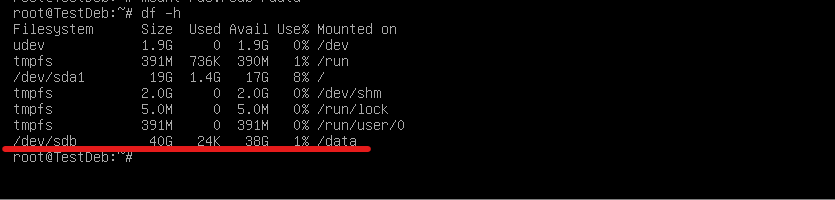
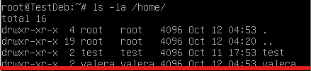
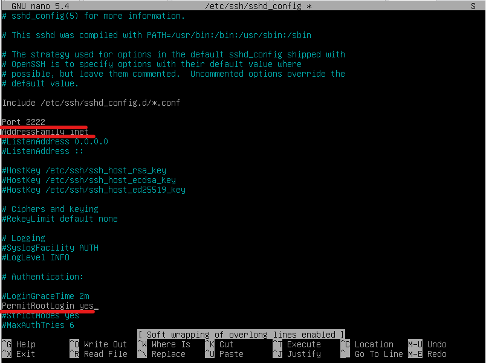

# Практическая работа №2. Настройка и конфигурация Linux-систем и прав доступа на базе Debian 11.


## Содержание

  - [Используемый стек](#Используемый)
  - [Задание](#Задание)
  - [Выполнение](#Выполнение)


## Используемый стек
  - VMWare Workstation
  - Операционная система Linux Debian 11 консольная

## Задание

	1. Выделить место на VMware под новый HDD.
	2. Создать новый HDD.
	3. Создать директорию “Data”.
	4. Примонтировать новый HDD в Linux системе к вновь созданной директории “Data”.
	5. Создать новую группу “CYB”.
	6. Создать папку “23” в директории “Data”.
	7. Назначить на данную папку “23” группу “CYB”.
	8. Создать нового пользователя.
	9. Назначить пароль.
	10. Включить нового пользователя в группу “CYB”.
	11. Убедиться, что в домашнем каталоге создана директория с новым пользователем.
	12. Назначить права доступа для нового пользователя, таким образом на директорию “Data”, чтобы результат работы команды ls был отрицательным, пояснить вывод команды ls.
	13. Залогиниться новым пользователем в Linux, проверить работу 16 пункта.
	14. Установить SSH-сервер (сменить стандартный порт на любой другой) продемонстрировать подключение с linux на linux.
	16 .Подключиться из Windows (основная операционная система, у кого-то может быть и MAC, по поводу установки PuTTY на MAC есть статья) на виртуальную машинку Linux по SSH с помощью PuTTY Установка и настройка Putty
	17. Настроить SFTP
	18. Проверить работу после перезапуска системы, что все настройки сохранились.


## Выполнение

### Выделение диска

	В первую очередь создаем диск в vmware. 

	

	Посмотрим, что мы имеем до всех настроек. Для этого посмотрим список дисков
	```
	 fdisk -l
	```
	

	Отлично! Теперь начинаем выполнение задания. Для начала создадим папку в корне машины и примонируем в нее диск

	```
	# Создаем дирикторию
	sudo mkdir /data/
  # Делаем разметку диска
  sudo mkfs.ext4 /dev/sdb
  # Монтируем диск в нашу папку
  sudo mount /dev/sdb /data
  # Проверяем, что диск успешно примонтирован
  df -h
	```
	


	Теперь нам нужно сделать так, чтобы при перезапуске системы диск оставался примонтированным в папку /data. Для этого нужно внести настройки в файлик /etc/fstab

	```
	sudo echo  “/dev/sdb /data ext4 defaults 0 0" >> /etc/fstab	
	```

### Создание группы и пользователя, изменение прав доступа

	Для начала создаем группу "CYB"

	```
	sudo groupadd CYB
	```

	Теперь создадим папку "23" и назначим ее на групу CYB

	```
	# Создаем папку
	sudo mkdir /data/23
	# Изменяем группу
	sudo chgrp CYB /data/23
	```

	Создаем пользователя

	```
	# Создать пользователя -m - создать домашню дирикторию -s - задать рабочую оболочку
	sudo useradd -m -s /bin/bash valera 
	# Задать пароль пользователю
	sudo passwd valera
	# Добавить пользователя в группу
	sudo usermod valera -aG CYB
	# Проверить наличие необходимой папки в домашней дириктории
	ls -la /home/
	# Изменяем права доступа в папку /data для отрицательного вывода ls. 700 - полные права у хозяина и никаких прав у остальных пользователей
	sudo chmod 700 data 
	```

	
	


### SSH

  Для начала установим ssh сервер:

  ```
  sudo apt update && sudo apt install -y ssh
  ```

  Теперь нам нужно отредактировать конфиг ssh для дальнейшего использования, для этого зайдем в настройки конфигурации, сменим порт, разрешим только ipv4 семейство адресов и логин root пользователя

  ```
  sudo nano /etc/ssh/sshd_config
  ```

  

  SSH сервер готов, применяем настройки и попробуем подключиться на него с другой linux машины и с основной системы через putty

  ```
  sudo systemctl restart ssh
  ```

  #### Linux to Linux
   
  


  #### Putty

  

  

### SFTP
