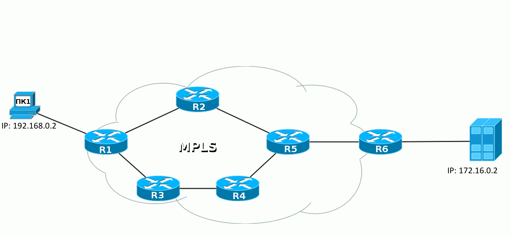
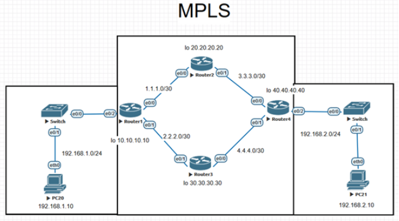

# Лабораторная работа №10 - MPLS

[**Все лабораторные работы по сетям и системам передачи данных**](./README.md)

## Теоретическая справка и материалы для изучения

**MPLS** (англ. multiprotocol label switching — многопротокольная коммутация по меткам) — механизм в высокопроизводительной телекоммуникационной сети, осуществляющий передачу данных от одного узла сети к другому с помощью меток. 



Гифка взята из [статьи на Хабре](https://habr.com/ru/post/246425/), [там](https://habr.com/ru/post/246425/), кстати, можно подробнее прочитать о принципах работы протоколов.

Также для понимания MPLS можно [посмотреть видео с YouYube](https://www.youtube.com/watch?v=hZyfM4UZDac)

## Ход работы

Перед насойкой MPLS необходимо полностью настроить ip-сеть. В центральной зоне топологии [настроим протокол динамической маршрутизации](RIP,%20OSPF.md).



### Настройка интерфейсов

Настойка Router 1:

```
en 
conf t 
hostname R1 
int loopback 0 
ip address 10.10.10.10 255.255.255.255 
exit 
int e0/2 
ip address 192.168.1.1 255.255.255.0 
no sh 
exit 
int e0/0 
ip address 1.1.1.1 255.255.255.252 
no sh 
exit 
int e0/1 
ip address 2.2.2.1 255.255.255.252 
no sh 
exit 
exit 
wr 
```

Настойка Router 2:

```
en 
conf t 
hostname R2 
int loopback 0 
ip address 20.20.20.20 255.255.255.255 
exit 
int e0/0 
ip address 1.1.1.2 255.255.255.252 
no sh 
exit 
int e0/1 
ip address 3.3.3.2 255.255.255.252 
no sh 
exit 
exit 
wr 
```

Настойка Router 3:

```
en 
conf t 
hostname R3 
int loopback 0 
ip address 30.30.30.30 255.255.255.255 
exit 
int e0/0 
ip address 2.2.2.2 255.255.255.252 
no sh 
exit 
int e0/1 
ip address 4.4.4.2 255.255.255.252 
no sh 
exit 
exit 
wr
```

Настойка Router 4:

```
en 
conf t 
hostname R4 
int loopback 0 
ip address 40.40.40.40 255.255.255.255 
exit 
int e0/0 
ip address 3.3.3.1 255.255.255.252 
no sh 
exit 
int e0/1 
ip address 4.4.4.1 255.255.255.252 
no sh 
exit 
int e0/2 
ip address 192.168.2.1 255.255.255.0 
no sh 
exit 
exit 
wr
```

### Настройка маршрутизации

#### Вариант 1 - [OSPF](RIP,%20OSPF.md#OSPF)

Настойка Router 1:
```	
en 
conf t  
router ospf 1  
passive-interface default  
no passive-interface e0/0 
no passive-interface e0/1 
network 192.168.1.0 0.0.0.255 area 1  
network 1.1.1.0 0.0.0.3 area 0 
network 2.2.2.0 0.0.0.3 area 0 
network 10.10.10.10 0.0.0.0 area 0 
exit 
exit 
wr
```

Настойка Router 2:
```	
en 
conf t  
router ospf 1 
network 1.1.1.0 0.0.0.3 area 0 
network 3.3.3.0 0.0.0.3 area 0 
network 20.20.20.20 0.0.0.0 area 0 
exit 
exit 
wr
```

Настойка Router 3:	
```
en 
conf t 
router ospf 1 
network 2.2.2.0 0.0.0.3 area 0 
network 4.4.4.0 0.0.0.3 area 0 
network 30.30.30.30 0.0.0.0 area 0 
exit 
exit 
wr 
```

Настойка Router 4:	
```
en 
conf t  
router ospf 1 
passive-interface default 
no passive-interface e0/0 
no passive-interface e0/1 
network 192.168.2.0 0.0.0.255 area 2 
network 3.3.3.0 0.0.0.3 area 0 
network 4.4.4.0 0.0.0.3 area 0 
network 40.40.40.40 0.0.0.0 area 0 
exit 
exit 
wr
```

Для всех можно добавить:
```
redistribute connected subnets
```

#### Вариант 2 - [RIP](RIP,%20OSPF.md#RIP)

Router 1

```
en
conf t
router rip
version 2
network 10.10.10.10
network 1.1.1.0
network 2.2.2.0
network 192.168.1.0
redistribute connected
no auto-summary
do wr
```

Router 2

```
en
conf t
router rip
version 2
network 20.20.20.20
network 1.1.1.0
network 3.3.3.0
redistribute connected
no auto-summary
do wr
```

Router 3

```
en
conf t
router rip
version 2
network 30.30.30.30
network 2.2.2.0
network 4.4.4.0
redistribute connected
no auto-summary
do wr
```

Router 4

```
en
conf t
router rip
version 2
network 40.40.40.40
network 3.3.3.0
network 4.4.4.0
network 192.168.2.0
redistribute connected
no auto-summary
do wr
```

### Настройка MPLS

Настойка Router 1:
```
en
conf t 
ip cef  
mpls ip  
mpls label protocol ldp  
mpls ldp router-id loopback 0  
int e0/0 
mpls ip 
mpls mtu 1410 
exit 
int e0/1 
mpls ip 
mpls mtu 1410 
exit 
exit 
wr
```

Настойка Router 2:
```
en
conf t 
ip cef 
mpls ip 
mpls label protocol ldp 
mpls ldp router-id loopback 0 
int e0/0 
mpls ip 
mpls mtu 1410 
exit 
int e0/1 
mpls ip 
mpls mtu 1410 
exit 
exit 
wr 
```

Настойка Router 3:
```
en
conf t 
ip cef 
mpls ip 
mpls label protocol ldp 
mpls ldp router-id loopback 0 
int e0/0 
mpls ip 
mpls mtu 1410 
exit 
int e0/1 
mpls ip 
mpls mtu 1410 
exit 
exit 
wr
```

Настойка Router 4:
```
en
conf t 
ip cef 
mpls ip 
mpls label protocol ldp 
mpls ldp router-id loopback 0 
int e0/0 
mpls ip 
mpls mtu 1410 
exit 
int e0/1 
mpls ip 
mpls mtu 1410 
exit 
exit 
wr 
```

Для проверки работоспособности можно использовать следующие команды:
```
sh mpls ip binding
sh mpls forwarding-tables
sh mpls ldp neighbor
```

Первая команда выводит таблицу соответствия меток и маршрутов, вторая - таблицу LFIB, третья - таблицу соседий по [протоколу LDP](https://habr.com/ru/post/246425/#LDP).

**LFIB** — Label Forwarding Information Base — по аналогии с FIB — это база меток, к которой обращается сетевой процессор. При получении нового пакета нет нужды обращаться к CPU и делать lookup в таблицу меток — всё уже под рукой.
