# Лабораторная работа №8 - OpenVPN-L2

[**Все лабораторные работы по сетям и системам передачи данных**](./README.md)

## Создание стенда

**Создаём:**
1. Выход в Интернет (Cloud1 ☁)
2. Фаерволлы

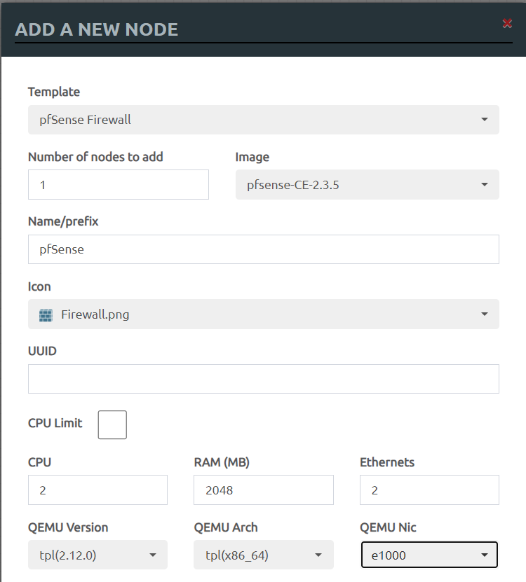

3. OpenVPN-L2 сервер

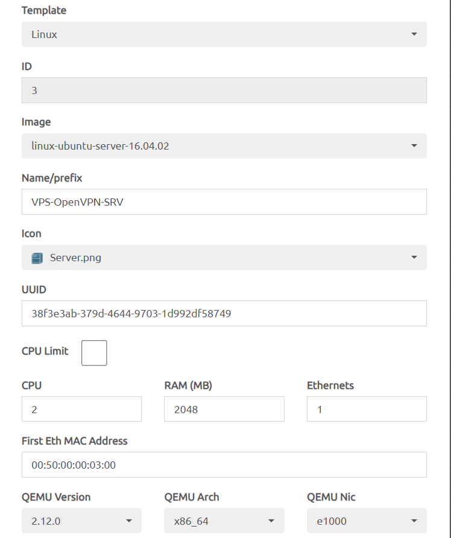

4. Коммутаторы

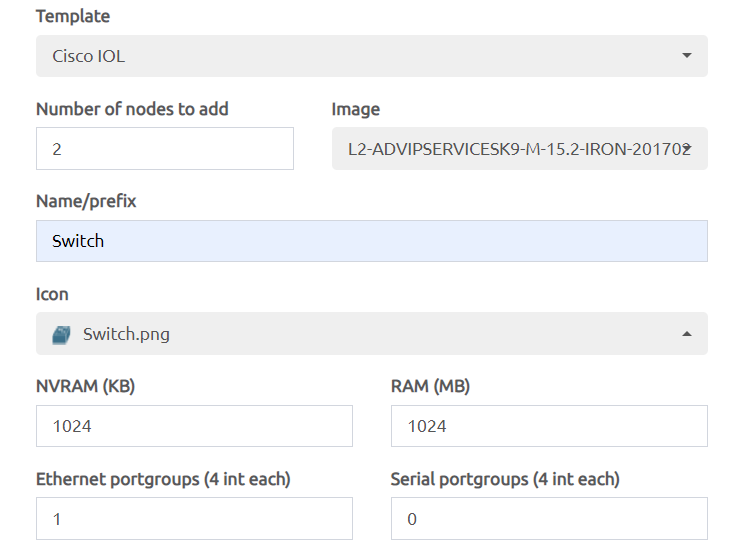

5. Kali Linux машины

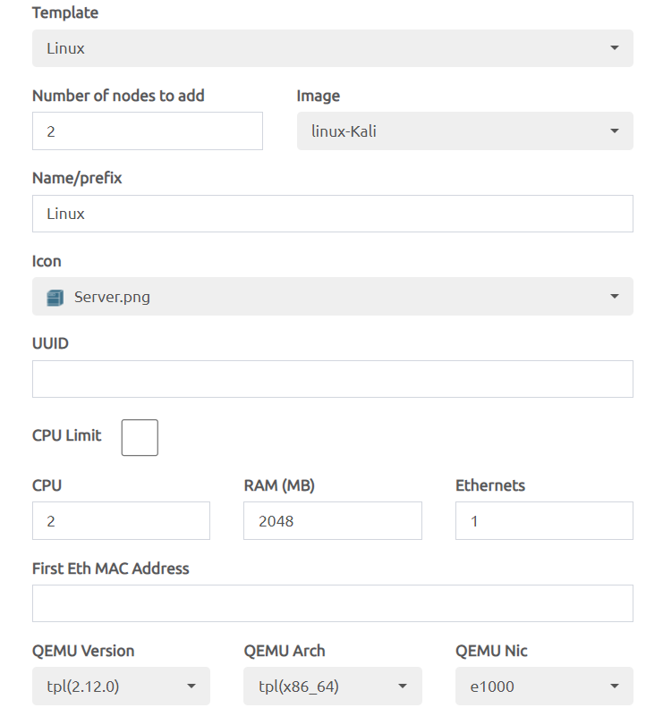

6. Linux Shared машинки

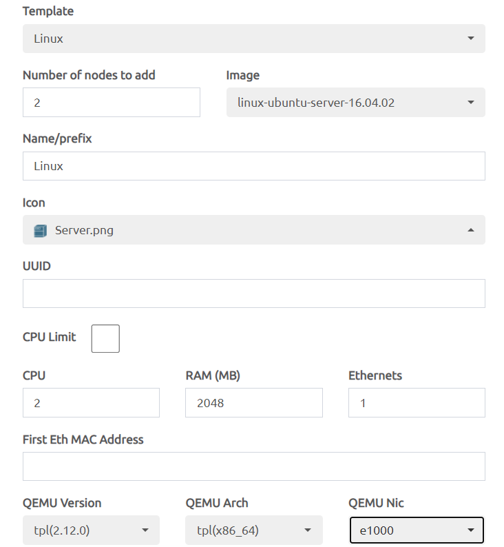

В итоге должна получиться следующая схема

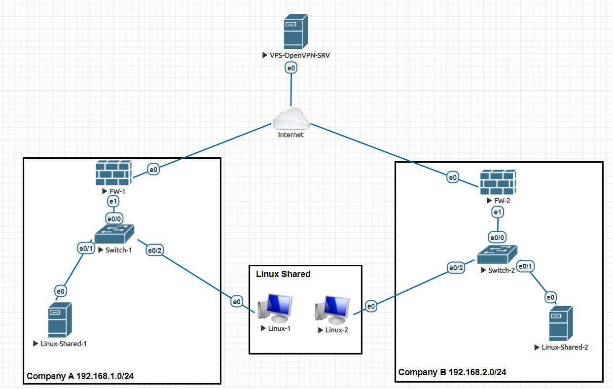

## Первичная настройка сервера

Классическая настройка интерфейсов и названия хостов:

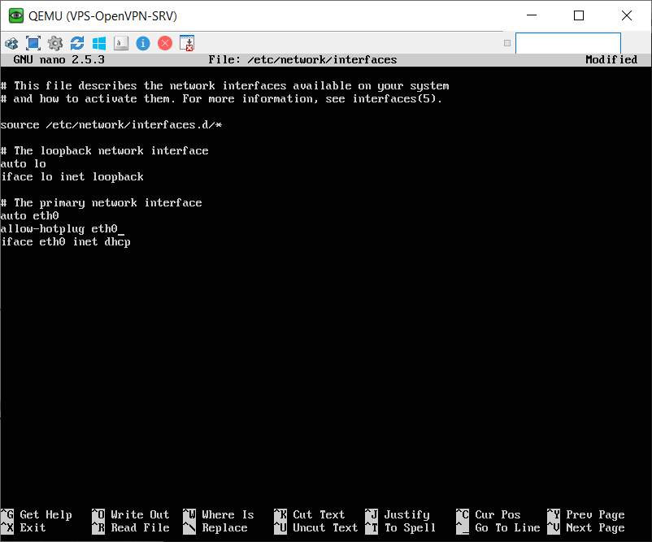

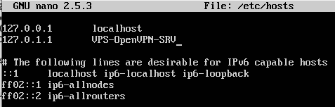


Установка Open-VPN:

```
apt update
apt install curl

curl -O https://raw.githubusercontent.com/angristan/openvpn-install/master/openvpn-install.sh
chmod +x openvpn-install.sh

./openvpn-install.sh
```

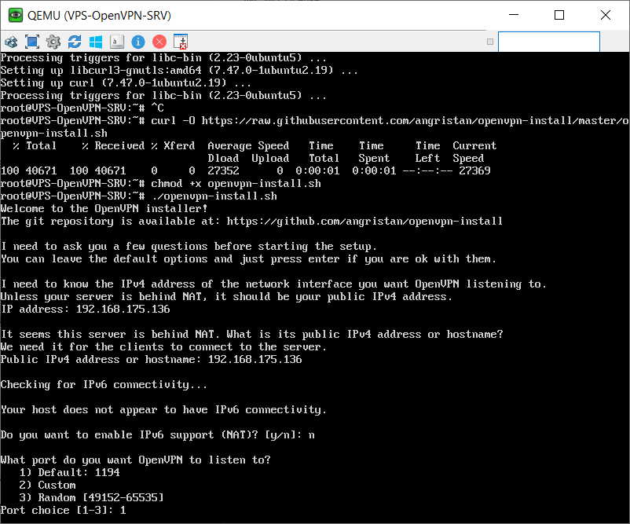

При установке отмечаем три единицы и затем два раза отвечаем "No"

Добавляем клиентов:

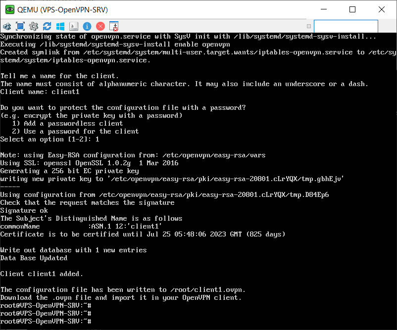

Чтобы добавить второго выполняем `./openvpn-install.sh` ещё раз.

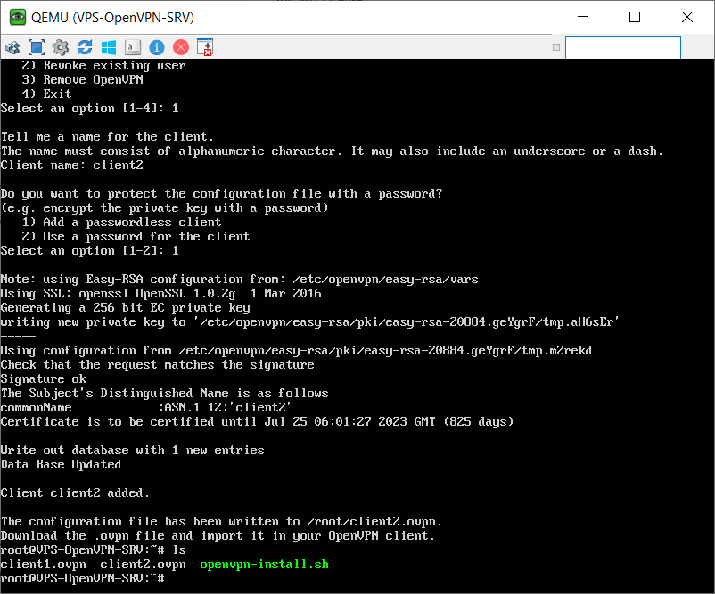

## Настройка файерволлов

**Справка**

> **Отличие WAN от LAN**
> WAN — сеть внешняя, глобальная, LAN — сеть внутренняя, локальная
> WAN не ограничивается территорией, LAN не может быть очень большой протяженности
> В роутерах порт WAN предназначен для интернет-соединения, LAN – для локальных устройств пользователя

Замена LAN

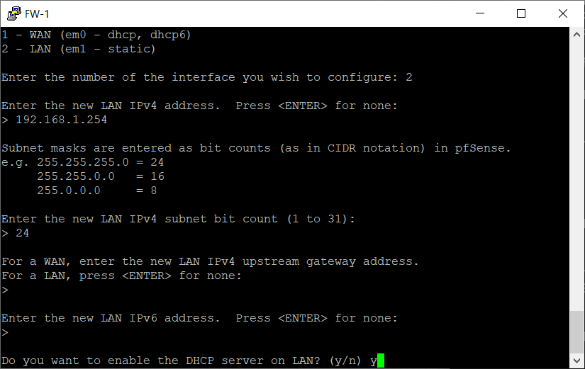

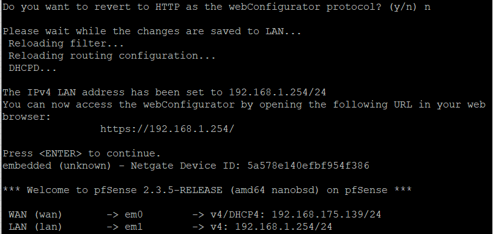

Аналогично настраиваем второй файерволл

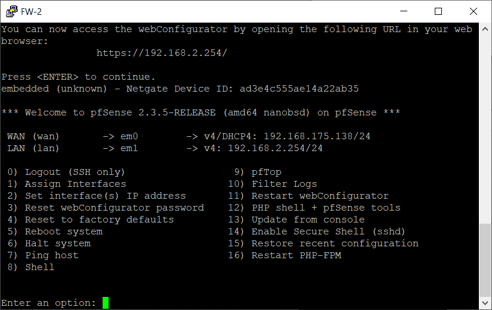

## Настраиваем Linux-Shared

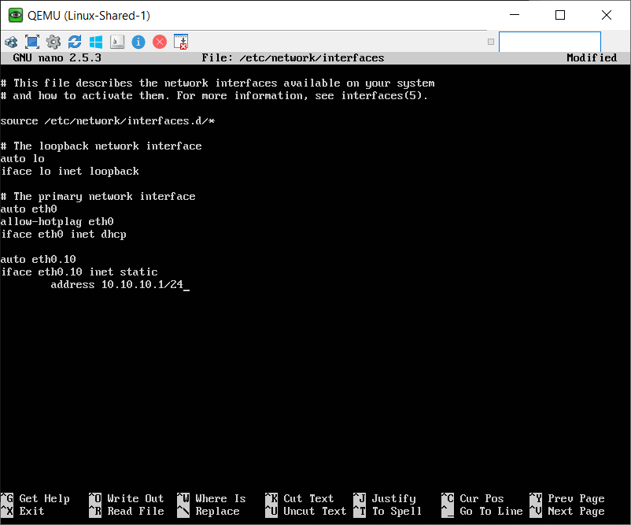

Не забываем про `hosts` и `hostname`. После перенастройки отключим сетку.

## Настройка Switch

```
en
conf t
hostname Switch-1

int e0/0
switchport trunk encapsulation dot1q
switchport mode trunk
ex

vlan 10
name Shared-Net
ex

int e0/2
switchport mode access
switchport access vlan 

do wr
```

## Настройка на Kali Linux

После изменений в файле `/etc/network/interfaces` сеть Kali имеет следующее состояние.


После перезабуска сети (`service networking restart`) Kali Linux должен успешно пинговать Linux Shared.


Во время настройки может возникать следующая ошибка

```
-Job for networking.service failed because the control process exited with error code. 
See "systemctl status networking.service" and "journalctl -xe" for details.
```

для решения необходимо либо ещё раз перезагрузить сеть, либо проверить правильность вписанных конфигураций на коммутаторе, Linux Shared или Kali Linux.

Аналагичную настройку следует провести на втором Kali.

## На сервере

Поменять в файле `/etc/openvpn/server.conf` `dev tun` на `dev tap` так мы обозначаем работу на уровне L2. Удаляем строки с `push`.
