# Лабораторная работа №7 - OpenVPN-L3

[**Все лабораторные работы по сетям и системам передачи данных**](./README.md)

# Топология
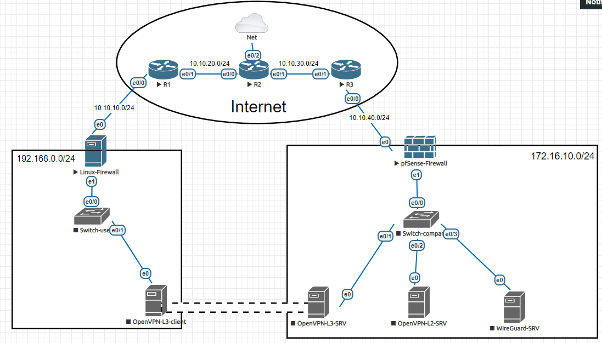

* 3 Cisco IOL со стандартными настройками
* 1 Network Type Cloud 1
* 1 pfSense-Firewall  версия 2.4.4 QEMU Nic e1000
* 2 Switch (Cisco IOL L2)
* 5 Linux Debian (Linux-Firewall c двумя интернет портами) QEMU Nic e1000

Важно: перед тем как соединить R2 c Net назначаем ему hostname

# Настройка Cisco Router

Сначала включаем только 3 Cisco Router

## R1

```
interface Ethernet0/0
description 'Linux-Firewall'
ip address 10.10.10.1 255.255.255.0
no sh

interface Ethernet0/1
description 'R2'
ip address 10.10.20.1 255.255.255.0
no sh
```

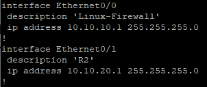

`ip route 0.0.0.0 0.0.0.0 10.10.20.2`

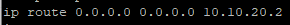

`wr`

## R3

```
interface Ethernet0/0
description 'pfSense-Firewall'
ip address 10.10.40.3 255.255.255.0
no sh

interface Ethernet0/1
description 'R2'
ip address 10.10.30.3 255.255.255.0
no sh
```

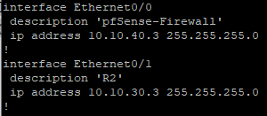

`ip route 0.0.0.0 0.0.0.0 10.10.30.2`

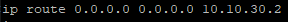

`wr`

## R2

```
interface Ethernet0/0
description 'R1'
ip address 10.10.20.2 255.255.255.0
ip nat inside
no sh

interface Ethernet0/1
description 'R2'
ip address 10.10.30.2 255.255.255.0
ip nat inside
no sh

interface Ethernet0/2
ip address dhcp
ip nat outside
no sh
exit

ip nat inside source list 1 
interface Ethernet0/2 overload
ip route 10.10.10.0 255.255.255.0 10.10.20.1
ip route 10.10.40.0 255.255.255.0 10.10.30.3
```


# Настройка Linux-Firewall

Включаем Linux-Firewall и pfSense-Firewall

`nano /etc/hosts`

стереть нижние строки с #

заменить Debian-10 на Linux-Firewall

`nano /etc/hostname`

заменить на Linux-Firewall

`nano /etc/network/interfaces`

под `#The primary…` стираем всё и пишем

```
auto ens3
allow-hotplug ens3
iface ens3 inet static
    address 10.10.10.10./24
    gateway 10.10.10.1

auto ens4
allow-hotplug ens4
iface ens4 inet static
    address 192.168.0.254/24
```

`nano etc/resolv.conf`

тут должно быть только `nameserver 8.8.8.8`, сохраняем и делаем `reboot`, затем обновляемся:

```
apt update
apt upgrade
```

# Настройка OpenVPN-L3 client

Включаем последовательно Switch-user, OpenVPN-L3

`nano /etc/hosts`

стереть нижние строки с `#` ,заменить Debian-10 на OpenVPN-L3

`nano /etc/hostname`

заменить на OpenVPN-L3

`nano /etc/network/interfaces`

под `#The primary…` стираем всё и пишем

```
auto ens3
allow-hotplug ens3
iface ens3 inet static
    address 192.168.0.10/24
    gateway 192.168.0.254
```

`nano etc/resolv.conf`

тут должно быть только `nameserver 8.8.8.8`, сохраняем и делаем `reboot`.

# Настройка iptables

Есть `ping 192.168.0.254`, но нет `ping 8.8.8.8`, поэтому настроим [iptables](iptables.md)

В Linux-Firewall:

`nano /etc/network/interfaces`

под всеми записями пишем

```
post-up iptables -t nat -A POSTROUTING -o ens3 -j MASQUERADE
```

сохраняем настройки, перезапускаем сеть `service networking restart` командой `iptables -t nat -L -v` проверяем iptables. 

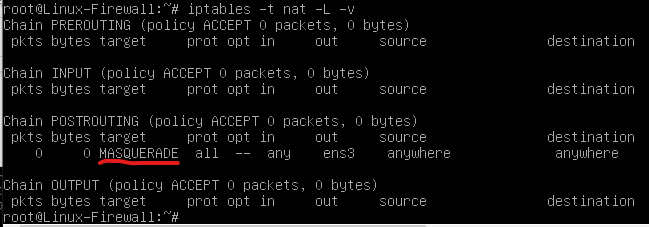

`nano /etc/sysctl.conf`

Раскоменчиваем

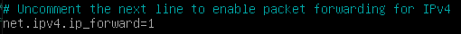

Обновляем

sysctl -p

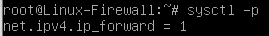

ping есть!

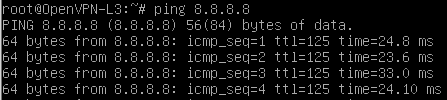

Обновления

`apt update && apt upgrade -y`

# Настройка pfSense-Firewall

Для настройки pfSense-Firewall потребуется Kali Linux

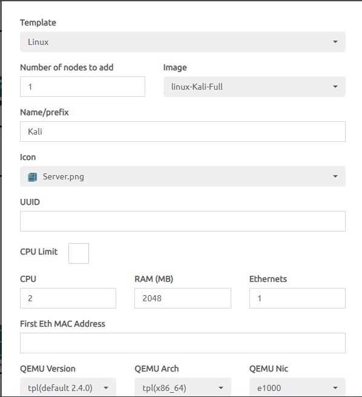

Чтобы соединить Kali c Switch-company, добавим портгруппу

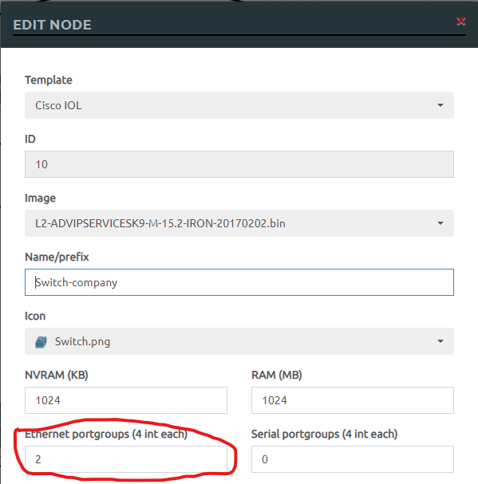

Дополненная часть топологии

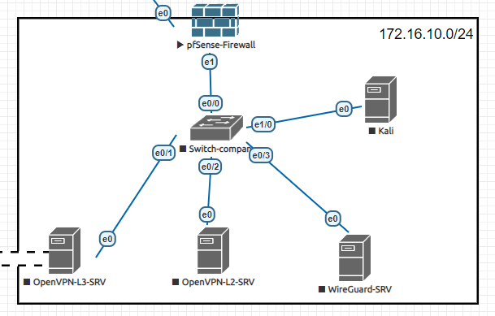

Включаем последовательно Switch-company, Kali

Настроим WAN интерфейс статикой, для этого переходим в pfSense-Firewall и выбираем 2 пункт

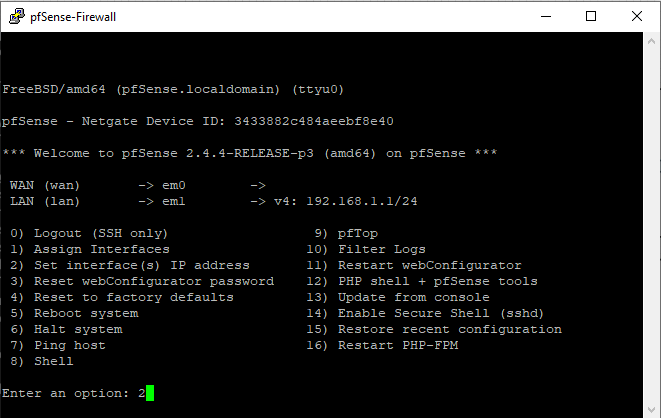

Затем выбираем 1, то есть сам WAN

выбираем n

вводим 10.10.40.10 

вводим 24

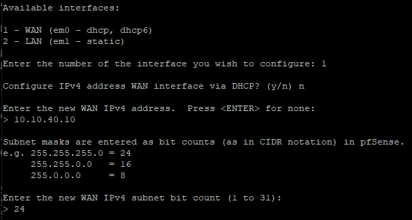

Вводим 10.10.40.3 (по сути, gateway)

Ставим n

Пропускаем, то есть нажимаем enter

Ставим n

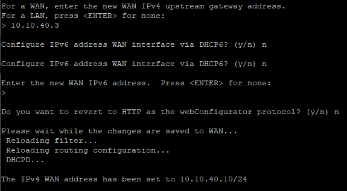

Проверим ping, для этого выберем 8 и пропингуем 8.8.8.8 и ya.ru

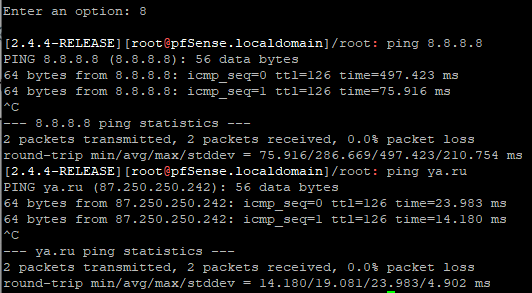

exit

Теперь меняем внутреннюю сетку компании

* Для этого снова выбираем 2
* Выбираем 2 (то есть LAN)
* Вводим 172.16.10.254 
* Вводим 24
* Пропускаем gateway, так как это LAN
* Пропускаем IPv6
* Ставим y (DHCP server нам нужен)
* Вводим 172.16.10.10
* Вводим 172.16.10.100
* Ставим n

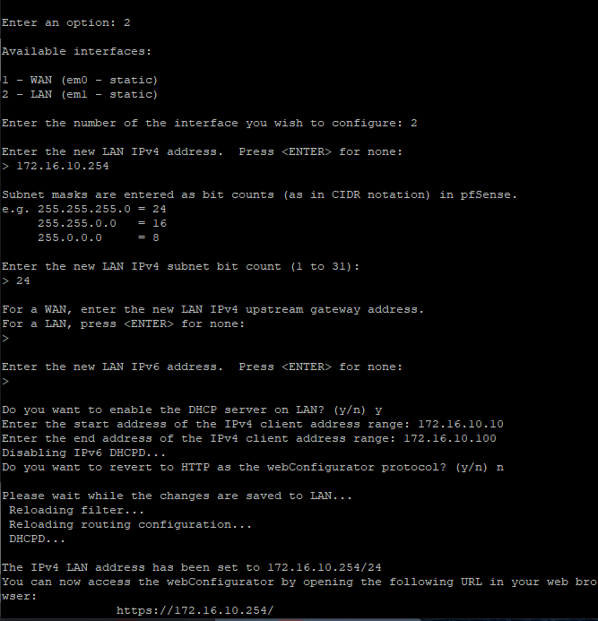

Переходим в Kali

Перезапускаем Wired Connection

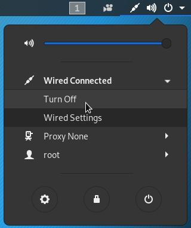

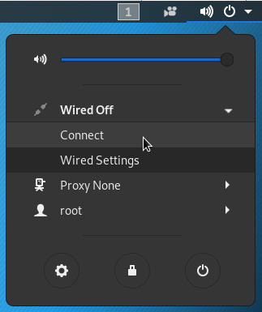

Смотрим адреса

`ip a`

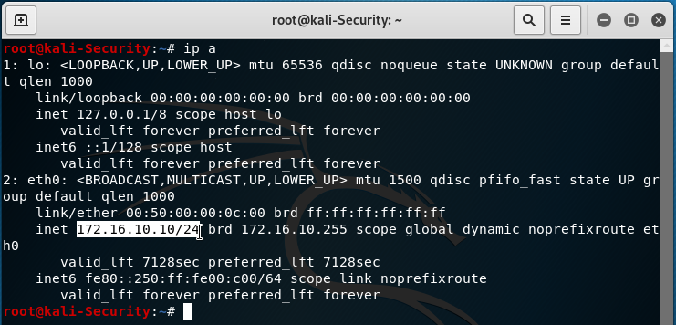

Пингуем

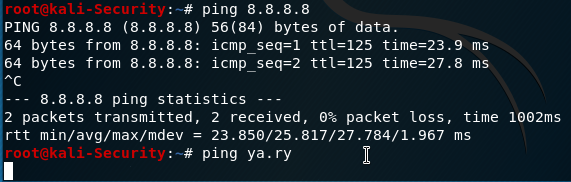

! Не пингуется Яндекс, проблема на pfSense-Firewall

Чтобы нормально настроить pfSense-Firewall меняем разрешение экрана 800\*600 (так удобнее)

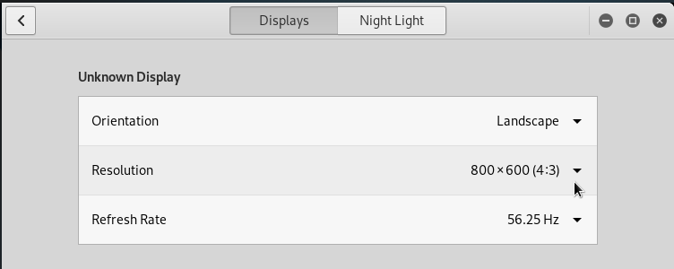

Заходим на pfSense-Firewall

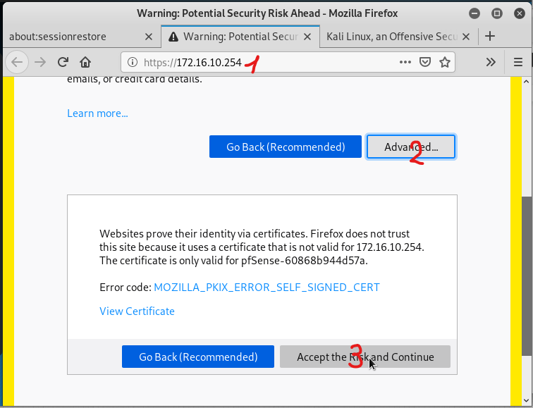

**Логин: admin  
Пароль: pfsense**

Нажать на логотип

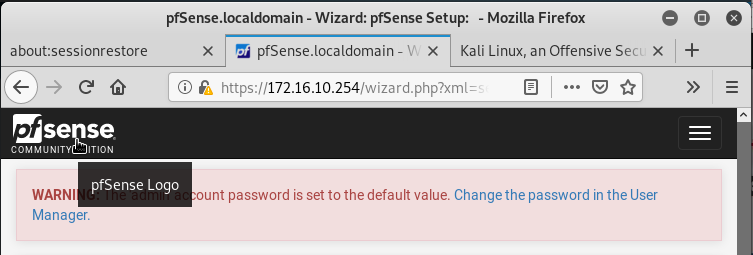

Заходим на WAN interface

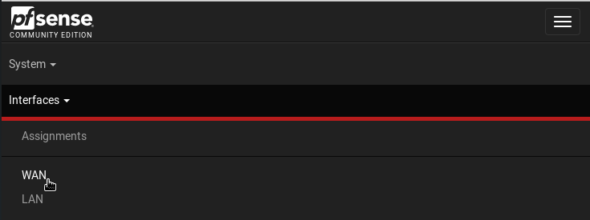

Убираем галочки в самом низу и сохраняем

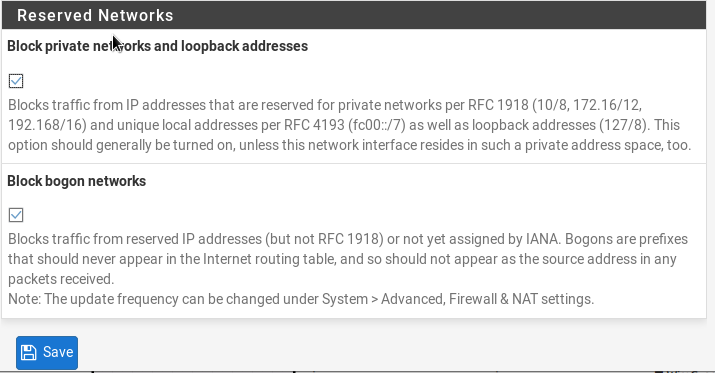

Применяем настройки, нажав Apply Changes

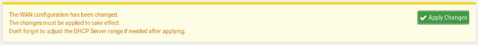

Пинг появился!

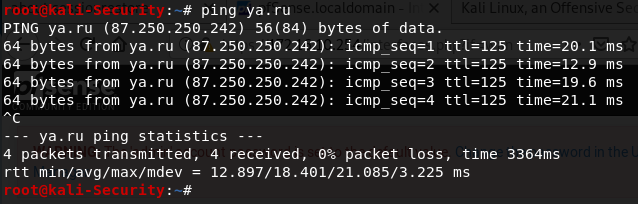

# Настройка OpenVPN-L3-SRV

`nano /etc/hosts`

стереть нижние строки с `#`, заменить Debian-10 на OpenVPN-L3-SRV

`nano /etc/hostname`

заменить на OpenVPN-L3-SRV

`nano /etc/network/interfaces`

под `#The primary…` стираем всё и пишем

```
auto ens3
allow-hotplug ens3
iface ens3 inet static
    address 172.16.10.240/24
    gateway 172.16.10.254
```

`nano etc/resolv.conf`

тут должно быть только `nameserver 8.8.8.8`, сохраняем и делаем `reboot`

Проверяем пинг 

`ping ya.ru`

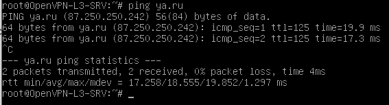

затем обновляемся

`apt update && apt upgrade -y`


# Настройка OpenVPN

Делать это нужно через Кали (Делаю прям как на видео, мануал непонятный)

Подключаемся по ssh 

```
ssh root@172.16.40.240
yes
eve@123
```

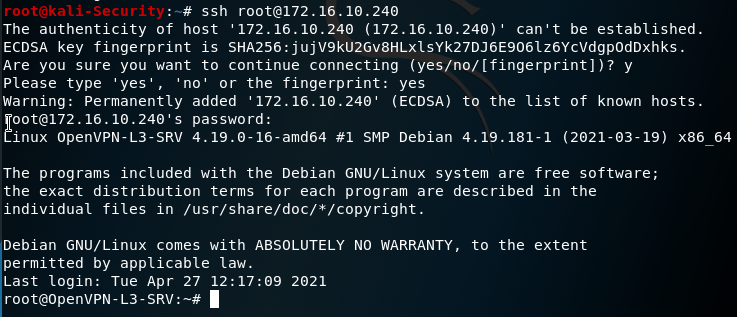

Проверяем обновления

`apt update`

Ставим curl

`apt install curl `

`y`

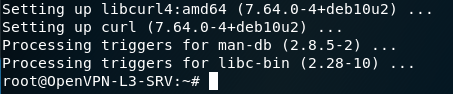

В браузере пишем в поиске **openvpn angristan**

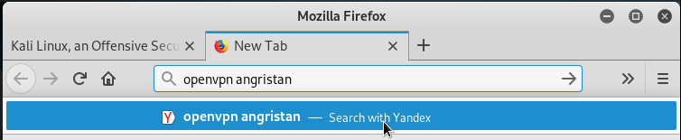

Переходим сюда

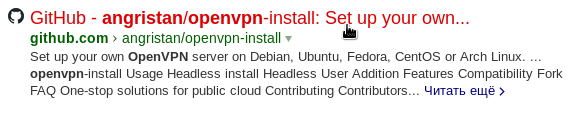

Копируем данный скрипт в терминал ПКМ

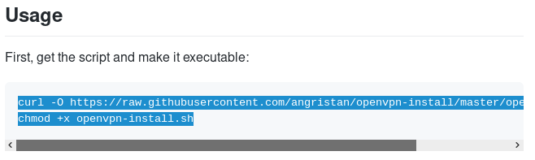

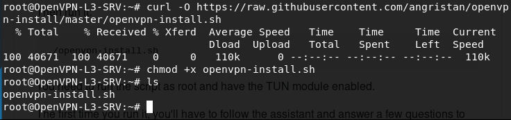

Запускаем скриптик

`./openvpn-install.sh`

Public IP ставим 

`10.10.40.10`

Дцблируем

`10.10.40.10`

`n`

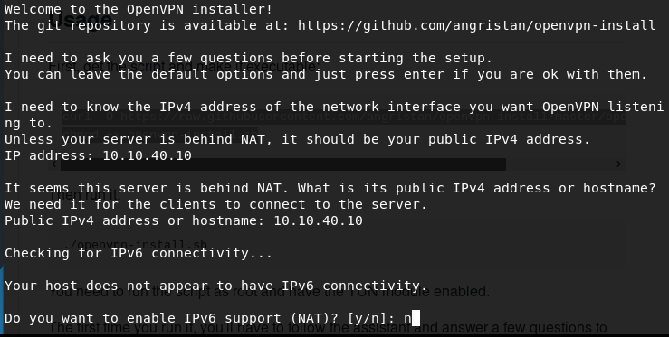

Выбираем дефолтный порт

`1`

Выбираем UDP

`1` 

Выбираем 1, так там нужная директория

`1` 

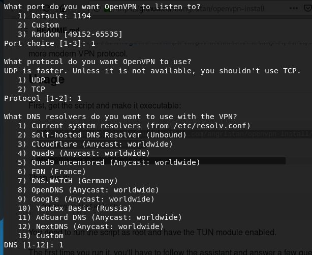

`n` 

`n` 

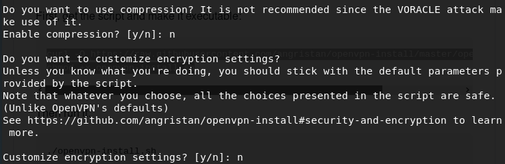

Загрузка...

Клиентское имя ставим

`client`

без пароля, то есть 1

1

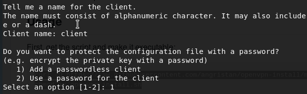

смотрим `ls` 

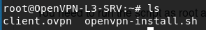

(В видео закинулось в home, у меня в root, надеюсь не критично, нужно это будет учесть) 

Пробрасываем порты через pfSense-Firewall

Зaходим на pfSense-Firewall

172.16.10.254

**Логин: admin  
Пароль: pfsense**

Firewall -> NAT

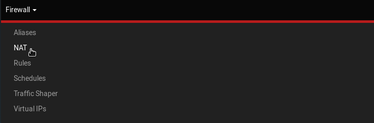

add

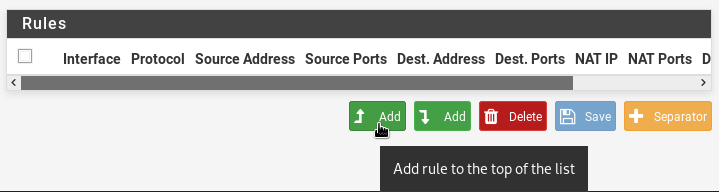

Настройки следующие

(остальное не меняем)

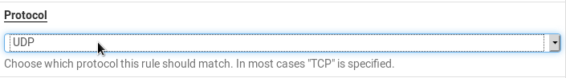

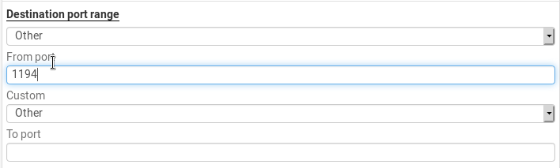

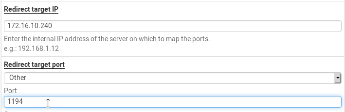

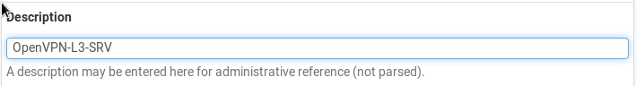

Нажимаем `Save`

Должно получится так 

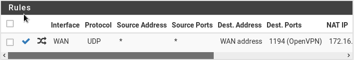

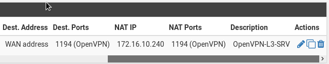

Не забываем нажать сюда

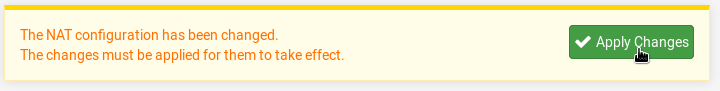

Добавим еще одно

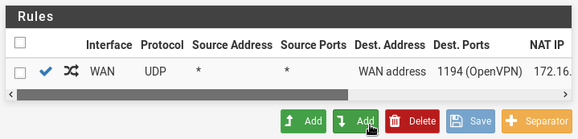

Настройки следующие

(остальное не меняем)


Нажимаем `Save`

Не забываем нажать сюда


Получилось


Проверим, где файлик


`exit`

копируем файлик на клиент

