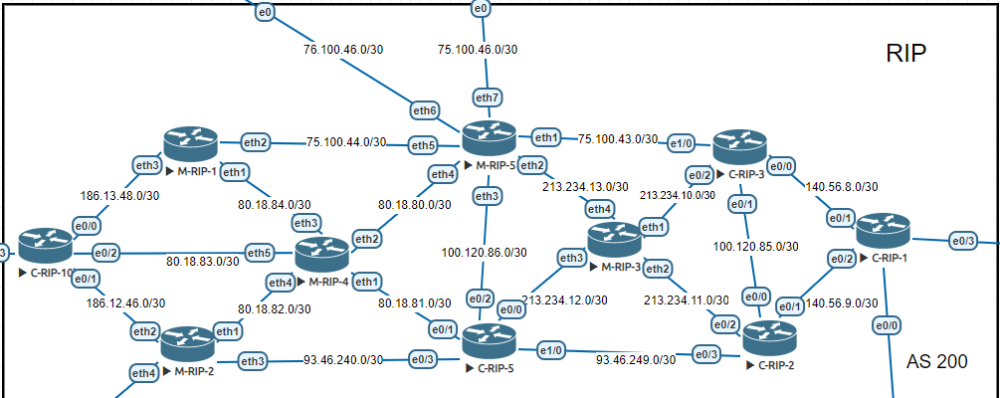
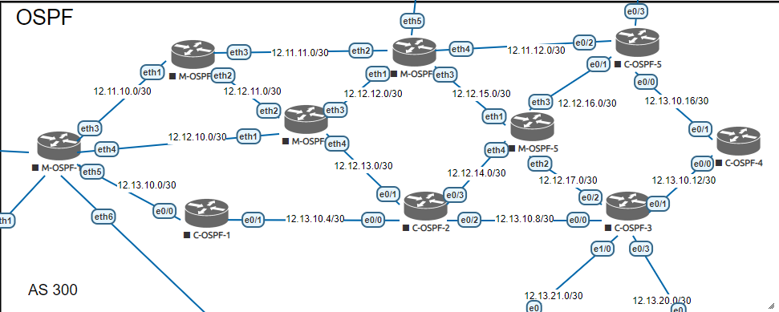

# Лабораторная работа №3  - Динамическая маршрутизация. Протоколы RIP и OSPF

* [Все лабораторные работы по сетям и системам передачи данных](./README.md)
* [Предыдущая лабораторная работа - Статическая маршрутизация](./static_routing.md)
* [Следующая лабораторная работа - Динамическая маршрутизация. Протокол BGP](./BGP.md)

---


## RIP
(англ.  Routing Information Protocol)  

Один из самых простых протоколов маршрутизации. Применяется в небольших компьютерных сетях, позволяет маршрутизаторам динамически обновлять маршрутную информацию (направление и дальность в хопах), получая ее от соседних маршрутизаторов.



### Настройка на Cisco

```
router rip
version 2
redistribute connected
network 75.0.0.0
network 100.0.0.0
network 140.56.0.0
network 213.234.10.0
```

### Настройка на Mikrotik

```
/routing rip
set redistribute-connected=yes
/routing rip network
add network=213.234.10.0/30
add network=213.234.11.0/30
add network=213.234.12.0/30
add network=213.234.13.0/30
```

## OSPF

(англ. Open Shortest Path First) 

Протокол динамической маршрутизации, основанный на технологии отслеживания состояния канала (link-state technology) и использующий для нахождения кратчайшего пути алгоритм Дейкстры.



### Настройка на Cisco

```
router ospf 1
redistribute connected subnets
network 12.12.13.0 0.0.0.3 area 0
network 12.12.14.0 0.0.0.3 area 0
network 12.13.10.4 0.0.0.3 area 0
network 12.13.10.8 0.0.0.3 area 0
```

### Настройка на Mikrotik

```
/interface bridge
add name=loopback
/routing ospf instance
set [ find default=yes ] router-id=10.255.255.5
/routing ospf network
add area=backbone network=12.12.15.0/30
add area=backbone network=12.12.16.0/30
add area=backbone network=12.12.17.0/30
add area=backbone network=12.12.14.0/30
```

## Сравнение протоколов RIP и OSPF

|Параметр|RIP| OSPF |
|---|---|---|
|База|DV|LS|
|Масштаб|Небольшие сети (дальность - 15 узлов)|Корпоративные сети|
|Маршрутизация|Механизм подсчёта петель маршрутизации класса|Бесклассовая|
|Метрика|Количество транзитных узлов при передаче|Обратная величина пропускной способности соединения|
|Обнаружение и обновления|Периодические обновления|DR multicats рассылки после каждого обновления схемы сети|
|Восстановление после сбоя|Медленное|Как правило, быстрее чем RIP|
|Балансировка нагрузки|Поддерживается только на путях с одинаковой стоимостью*|Поддержка 6 путей с одинаковой стоимостью*|

*Под стоимостью имеется ввиду величина метрики протокола

**Источники:**  
* https://ru.wikipedia.org/wiki/RIP_(%D1%81%D0%B5%D1%82%D0%B5%D0%B2%D0%BE%D0%B9_%D0%BF%D1%80%D0%BE%D1%82%D0%BE%D0%BA%D0%BE%D0%BB)
* https://ru.wikipedia.org/wiki/OSPF
* https://www.researchgate.net/profile/Uduak-Idio/publication/306407199/figure/download/tbl1/AS:755889191522306@1557229435228/Comparison-of-RIP-OSPF-and-EIGRP.png