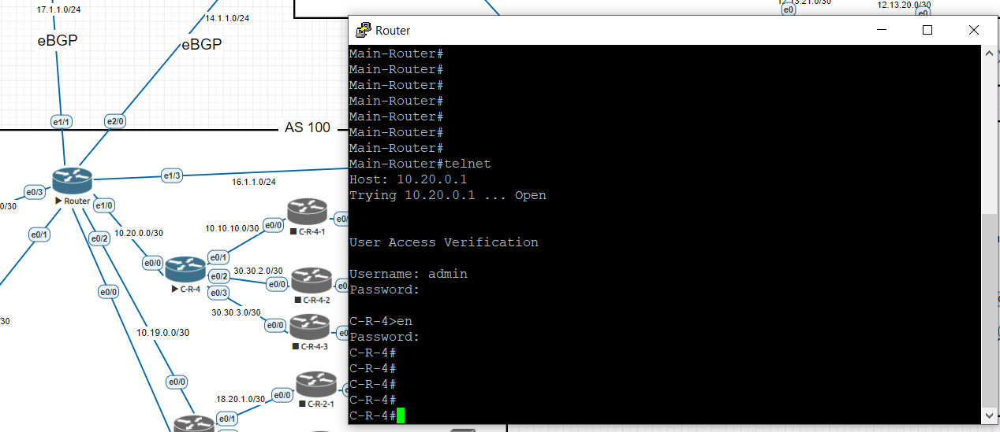
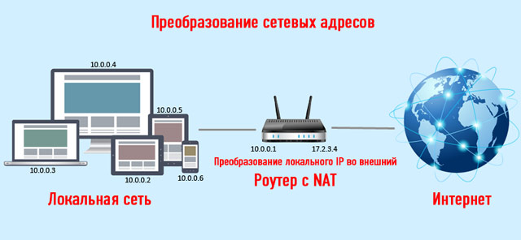

# Лабораторная работа №5  - SSH, NAT

* [Все лабораторные работы по сетям и системам передачи данных](./README.md)
* [Предыдущая лабораторная работа - Динамическая маршрутизация. Протокол BGP](./BGP.md)

---

## SSH

**SSH** (англ. Secure Shell — «безопасная оболочка») — сетевой протокол прикладного уровня, позволяющий производить удалённое управление операционной системой и туннелирование TCP-соединений (например, для передачи файлов). Схож по функциональности с протоколами Telnet и rlogin, но, в отличие от них, шифрует весь трафик, включая и передаваемые пароли. SSH допускает выбор различных алгоритмов шифрования. SSH-клиенты и SSH-серверы доступны для большинства сетевых операционных систем.

### Настройка SSH на CISCO

```
en
conf t
ip ssh version 2
ip domain name <domain>
crypto key generate rsa
service password-encryption
username <username> privilege <0-15> password <password>
aaa new-model
line vty 0 4
transport input all
logging synchronous
exec-timeout 60 0
exit
enable password <password>
do wr
```

[Здесь подробно описан алгоритм настройки](https://losst.ru/kak-polzovatsya-ssh)

### Подключение по ssh и telnet

На CISCO:
```
ssh -l <username> <ip>
```



На Microtik:
```
system ssh address=<ip> user=<username>
system telnet address=<ip> user=<username>
```

## NAT

**NAT** — это специальный механизм, реализованный в сетях TCP/IP, который позволяет изменять айпи адреса пересылаемых пакетов, т.е. тех внутренних IP, которые присылаются на сетевой шлюз — в глобальные для дальнейшей отправки во внешний интернет. Также, такие пакеты называют транзитными.



### Настройка NAT

```
interface Ethernet0/0
    description "M-RIP-1"
    ip address 186.13.48.2 255.255.255.252
    ip nat enable
!
interface Ethernet0/1
    description "M-RIP-2"
    ip address 186.12.46.2 255.255.255.252
    ip nat enable
!
interface Ethernet0/2
    description "C-RIP-7"
    ip address 80.18.83.2 255.255.255.252
    ip nat enable
!
interface Ethernet0/3
    description "ExtraNet-1"
    ip address dhcp
    ip nat enable
!
```

[Статья по настройке NAT](https://k.psu.ru/wiki/NAT_(%D0%BE%D0%B1%D0%B7%D0%BE%D1%80_%D0%B8_%D0%BF%D1%80%D0%B8%D0%BC%D0%B5%D1%80%D1%8B))

**Источники:**  
* https://losst.ru/kak-polzovatsya-ssh
* https://ru.wikipedia.org/wiki/SSH
* https://anisim.org/articles/nat/
* https://k.psu.ru/wiki/NAT_(%D0%BE%D0%B1%D0%B7%D0%BE%D1%80_%D0%B8_%D0%BF%D1%80%D0%B8%D0%BC%D0%B5%D1%80%D1%8B)
  