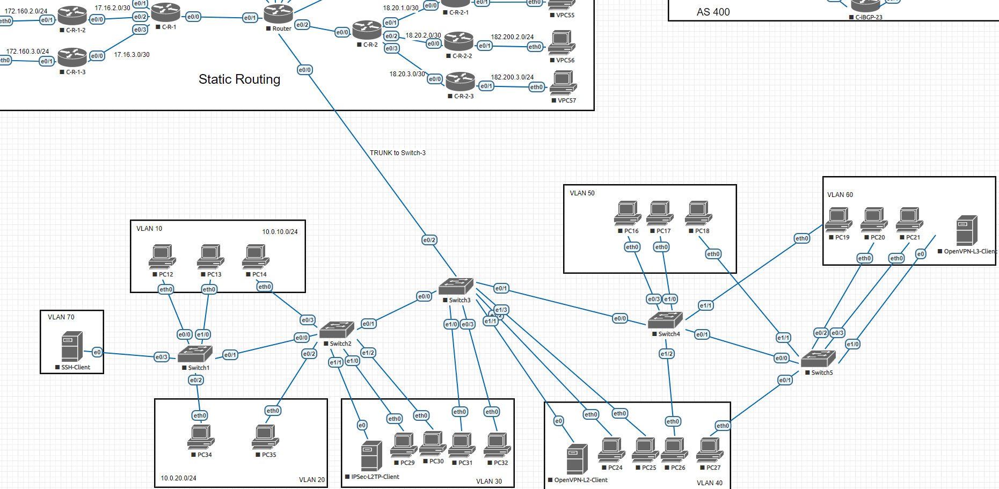

# Лабораторная работа №1 - VLAN, DHCP

* [Все лабораторные работы по сетям и системам передачи данных](./README.md)
* [Следующая лабораторная работа - Статическая маршрутизация](static_routing.md)

---
## Справочная информация

**Коммутатор** — устройство, предназначенное для соединения нескольких узлов компьютерной сети в пределах одного или нескольких сегментов сети. Коммутатор работает на канальном уровне модели OSI.

**Маршрутизатор** — специализированное устройство, которое пересылает пакеты между различными сегментами сети на основе правил и таблиц [маршрутизации](static_routing.md).

**DHCP** — протокол прикладного уровня модели TCP/IP, служит для назначения IP-адреса клиенту. Это следует из его названия — Dynamic Host Configuration Protocol. IP-адрес можно назначать вручную каждому клиенту, то есть компьютеру в локальной сети. Но в больших сетях это очень трудозатратно, к тому же, чем больше локальная сеть, тем выше возрастает вероятность ошибки при настройке. Поэтому для автоматизации назначения IP был создан протокол DHCP.

[Подробнее о работе протокола в статье](https://selectel.ru/blog/dhcp-protocol/)

**VLAN** (аббр. от англ. Virtual Local Area Network) — виртуальная локальная компьютерная сеть. Представляет собой группу хостов с общим набором требований, которые взаимодействуют так, как если бы они были подключены к широковещательному домену независимо от их физического местонахождения. VLAN имеет те же свойства, что и физическая локальная сеть, но позволяет конечным членам группироваться вместе, даже если они не находятся в одной физической сети. Такая реорганизация может быть сделана на основе программного обеспечения вместо физического перемещения устройств.

[Подробнее о работе протокола в статье](https://habr.com/ru/post/319080/)

## Примеры скриптов из лабораторной



Настройка интерфейсов:
```
en
conf t
hostname C-R-2

conf t
int e0/0
description "to switch3"
no shutdown
```

Switch1

```
interface Ethernet0/0
    description PC12
    switchport access vlan 10
    switchport mode access
!
interface Ethernet0/1
    description Switch2
    switchport trunk encapsulation dot1q
    switchport mode trunk
!
interface Ethernet0/2
    description PC34
    switchport access vlan 20
    switchport mode access
!
interface Ethernet0/3
    description SSH-client
    switchport access vlan 70
    switchport mode access
!
interface Ethernet1/0
    description PC13
    switchport access vlan 10
    switchport mode access
!
```

Main Router

```    
ip dhcp excluded-address 10.0.10.200 10.0.10.254
ip dhcp excluded-address 10.0.20.200 10.0.20.254
ip dhcp excluded-address 10.0.30.200 10.0.30.254
ip dhcp excluded-address 10.0.40.200 10.0.40.254
ip dhcp excluded-address 10.0.50.200 10.0.50.254
ip dhcp excluded-address 10.0.60.200 10.0.60.254
!
ip dhcp pool vlan-10
    network 10.0.10.0 255.255.255.0
    default-router 10.0.10.254
    domain-name vlan-10.yan.ru
    dns-server 8.8.8.8
!
ip dhcp pool vlan-20
    network 10.0.20.0 255.255.255.0
    default-router 10.0.20.254
    domain-name vlan-20.yan.ru
    dns-server 8.8.8.8
!
ip dhcp pool vlan-30
    network 10.0.30.0 255.255.255.0
    default-router 10.0.30.254
    domain-name vlan-30.yan.ru
    dns-server 8.8.8.8
!
ip dhcp pool vlan-40
    network 10.0.40.0 255.255.255.0
    default-router 10.0.40.254
    domain-name vlan-40.yan.ru
    dns-server 8.8.8.8
!
ip dhcp pool vlan-50
    network 10.0.50.0 255.255.255.0
    default-router 10.0.50.254
    domain-name vlan-50.yan.ru
    dns-server 8.8.8.8
!
ip dhcp pool vlan-60
    network 10.0.60.0 255.255.255.0
    default-router 10.0.60.254
    domain-name vlan-60.yan.ru
    dns-server 8.8.8.8


interface Ethernet0/0.10
    description vlan-10
    encapsulation dot1Q 10
    ip address 10.0.10.254 255.255.255.0
!
interface Ethernet0/0.20
    description vlan-20
    encapsulation dot1Q 20
    ip address 10.0.20.254 255.255.255.0
!
interface Ethernet0/0.30
    description vlan-30
    encapsulation dot1Q 30
    ip address 10.0.30.254 255.255.255.0
!
interface Ethernet0/0.40
    description vlan-40
    encapsulation dot1Q 40
    ip address 10.0.40.254 255.255.255.0
!
interface Ethernet0/0.50
    description vlan-50
    encapsulation dot1Q 50
    ip address 10.0.50.254 255.255.255.0
!
interface Ethernet0/0.60
    description vlan-60
    encapsulation dot1Q 60
    ip address 10.0.60.254 255.255.255.0
!
interface Ethernet0/0.70
    description MGMT
    encapsulation dot1Q 70
    ip address 10.0.70.254 255.255.255.0
!
```

`ip dhcp` - для проверки подключения компьютеров в первой лабораторной

Полезные команды:
`sh ip route` - показать известные маршруты

`ip route print` - для Mikrotik

`ping` + `ip-адрес` - отправить тестовые пакеты (проверка передачи данных по каналу)

`sh run` - просмотр конфигурации на Cisco

`export` - просмотр конфигурации на Mikrotik

`trace` + `ip-адрес` или `traceroute` + `ip-адрес` - трассировка на Cisco

`Ctrl` + `Shift` + `6` - завершить трассировку

`tool traceroute` + `ip-адрес` - трассировка на Mikrotik

