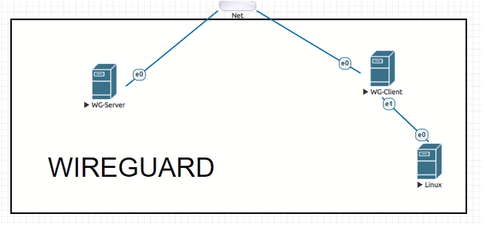
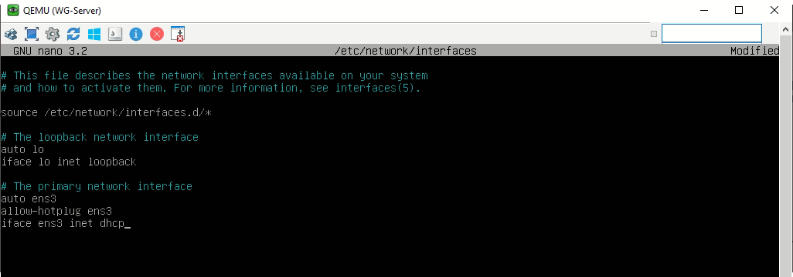
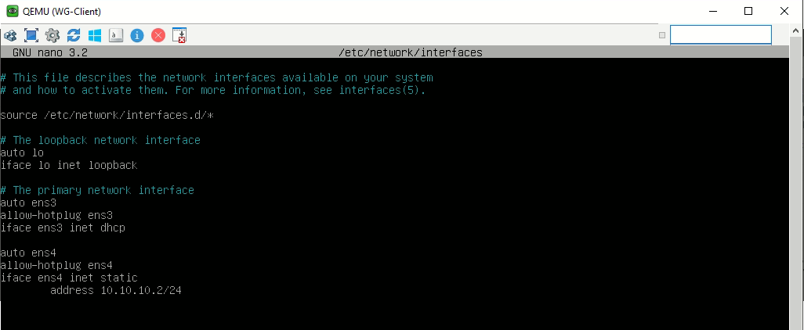
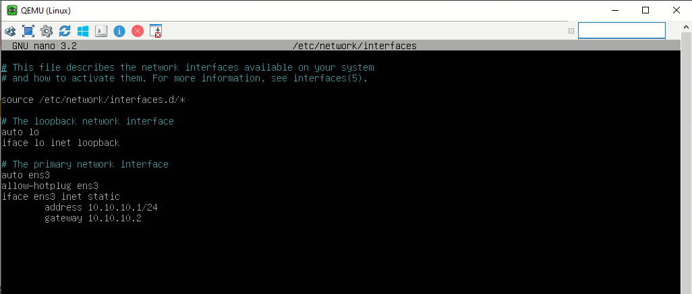
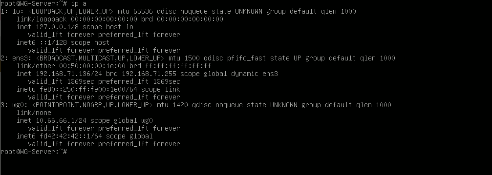
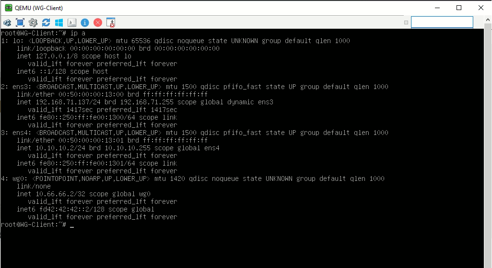
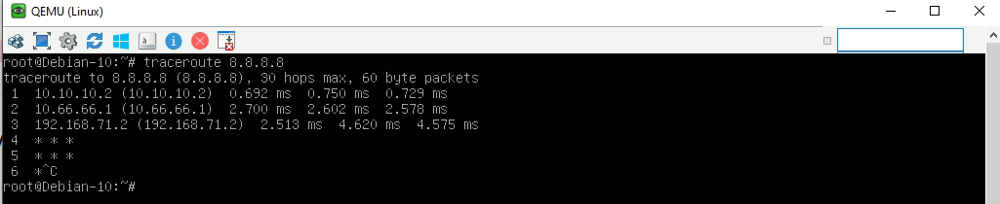

# Лабораторная работа №9 - WireGuard

[**Все лабораторные работы по сетям и системам передачи данных**](./README.md)

### 1. Топология



***

### 2. Устройства

  - Выход в интернет
  - Linux: linux-Debian-10-srv, Ehthernets: 2 Количество: 2шт
  - Linux: linux-Debian-10-srv, Ehthernets: 1 Количество: 1шт
  
***
  
### 3. Подготовка топологии к настройке

Для начала настроим наши машины, подключив их к интернету. Для этого изменим настройки интерфейсов. На каждом введем команду:
  ```
  nano /etc/network/interfaces
  ```
  
  На WG-Server:
  
  
  
  На WG-Client:
  
  
  
  На Linux:
  
  
  
 Затем установим все необходимые пакеты:
 
  На WG-Server:
  
  ```
  sudo apt-get update
  sudo apt-get install curl
  ```
  
  На WG-Client:
  
  ```
  echo "deb http://deb.debian.org/debian buster-backports main" >/etc/apt/sources.list.d/backports.list
  apt-get update
  apt-get install -y -t buster-backports wireguard resolvconf
  ```
  
***
  
  ### 4. Настойка Wireguard
  
  Перейдем к настройке Wireguard сервера. Для этого воспользуемся скриптом. Для начала этот скрипт нужно скачать и сделать исполняемым. Введем на WG-Server следующие команды:
  
  ```
  curl -O https://raw.githubusercontent.com/angristan/wireguard-install/master/wireguard-install.sh
  chmod +x wireguard-install.sh
  ```
  
  Затем запускаем скрипт командой:
  
  ```
  ./wireguard-install.sh
  ```
  
  Все настройки можно оставить по умолчанию или изменить ip адреса под себя. 
  
  Сразу после настройки wireguard сервера скрипт запустить создание клиента. Называем клиента, как пожелаем, допустим **user**
  
  Теперь нужно поменять название конфигурационного файла клиента. Текст, выделенный *курсивом* нужно изменить в соответствии с предыдущим шагом:
  
  ```
  mv /home/user/wg0-client-*user*.conf /home/user/wg0.conf
  ```
  
  После чего следует перезапустить машину:
  
  ```
  reboot
  ```
  
  Пока машина перезапускается, можно перейти к настройкам WG-Client. Создадим дерикторию wireguard и назначим ей права доступа:
  
  ```
  mkdir /etc/wireguard >/dev/null 2>&1
  chmod 600 -R /etc/wireguard/
  ```
  
  Когда сервер перезагрузится, забираем наш конфигурационный файл клиента по ssh:
  
  ```
  scp root@192.168.71.136:/home/user/wg0.conf /etc/wireguard
  ```
  
  Затем разрешаем автозагрузку wireguard и перезапускаем машину:
  
  ```
  systemctl enable wg-quick@wg0
  reboot
  ```
  
  После перезагрузки проверяем интерфейсы обоих машин, должен подняться интерфейс wg0:
  
  На WG-Server:
  
  
  
  На WG-Client:
  
  
  
***

### 5. Доступ в интернет для Linux:

  Теперь нам необходимо дать доступ к интернету для Linux. Для начала разрешим форвардинг трафика на WG-Client. Для этого изменим файл sysctl.conf
  
  ```
  nano /etc/sysctl.conf
  ```
  
  Раскоментируем строку net.ipv4.ip_forward=1 и применим настройки:
  
  ```
  sysctl -p
  ```
  
  Затем настроим на WG-Client наттинг трафика:
  
  ```
  iptables -t nat -A POSTROUTING -j MASQUERADE
  ```
  
  И теперь Linux так же имеет доступ в интернет через впн:
  
  
