# Лабораторная работа №1 - iptables

[**Все лабораторные работы по сетям и системам передачи данных**](./README.md)

## Теоретическое введение

Переходим на уровень L4 - Транспортный уровень ⬆️

---

### Модель OSI

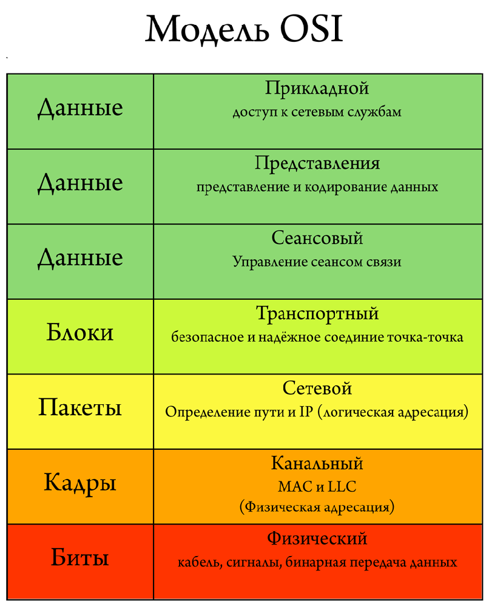

1) **Физический уровень (Physical Layer)**: определяет метод передачи данных, какая среда используется (передача электрических сигналов, световых импульсов или радиоэфир), уровень напряжения, метод кодирования двоичных сигналов.

2) **Канальный уровень (Data Link Layer)**: он берет на себя задачу адресации в пределах локальной сети, обнаруживает ошибки, проверяет целостность данных. Если слышали про MAC-адреса и протокол «Ethernet», то они располагаются на этом уровне.

3) **Сетевой уровень (Network Layer)**: этот уровень берет на себя объединения участков сети и выбор оптимального пути (т.е. маршрутизация). Каждое сетевое устройство должно иметь уникальный сетевой адрес в сети. Думаю, многие слышали про протоколы IPv4 и IPv6. Эти протоколы работают на данном уровне.

4) **Транспортный уровень (Transport Layer)**: Этот уровень берет на себя функцию транспорта. К примеру, когда вы скачиваете файл с Интернета, файл в виде сегментов отправляется на Ваш компьютер. Также здесь вводятся понятия портов, которые нужны для указания назначения к конкретной службе. На этом уровне работают протоколы TCP (с установлением соединения) и UDP (без установления соединения).

5) **Сеансовый уровень (Session Layer)**: Роль этого уровня в установлении, управлении и разрыве соединения между двумя хостами. К примеру, когда открываете страницу на веб-сервере, то Вы не единственный посетитель на нем. И вот для того, чтобы поддерживать сеансы со всеми пользователями, нужен сеансовый уровень.

6) **Уровень представления (Presentation Layer)**: Он структурирует информацию в читабельный вид для прикладного уровня. Например, многие компьютеры используют таблицу кодировки ASCII для вывода текстовой информации или формат jpeg для вывода графического изображения.

7) **Прикладной уровень (Application Layer)**: Наверное, это самый понятный для всех уровень. Как раз на этом уроне работают привычные для нас приложения — e-mail, браузеры по протоколу HTTP, FTP и остальное.

---

**Межсетево́й экра́н, сетево́й экра́н (firewall, ,брандмауэр)** — программный или программно-аппаратный элемент компьютерной сети, осуществляющий контроль и фильтрацию проходящего через него сетевого трафика в соответствии с заданными правилами (напр. в Интернет попасть можно, а вот входящее подключение блокируется). 

**Access List** - функционал роутера, позволяющий определить какой трафик разрешён.

С помощью межсетевого экрана можно перенаправлять трафик на конкретный порт.

**[Список портов TCP и UDP](https://ru.wikipedia.org/wiki/%D0%A1%D0%BF%D0%B8%D1%81%D0%BE%D0%BA_%D0%BF%D0%BE%D1%80%D1%82%D0%BE%D0%B2_TCP_%D0%B8_UDP)**

Прикольный мем на эту тему 😀:


**Файрволл запрещает всё, что не разрешено.**

**[Настройка Linux-файрвола iptables: Руководство для начинающих](https://1cloud.ru/help/linux/nastrojka_linus-firewall_iptables)**

### Типы правил

Существует три типа правил iptables — input, forward и output.

**Input** — Такие цепочки используются для контроля поведения входящих соединений. К примеру, если пользователь попробует подключиться к серверу по SSH, то iptables сравнит его IP-адрес со своим списком, чтобы разрешить или запретить доступ.

**Forward** — Правила этого типа используются для обработки входящих сообщений, конечный пункт назначения которых не является текущим сервером. К примеру, в случае маршрутизатора, к нему подключаются многие пользователи и приложения, но данные не посылаются на сам маршрутизатор, они лишь передаются ему, чтобы он мог перенаправить их адресату. Если вы не занимаетесь настройкой маршрутизации или NAT, то правила этого типа использовать в работе не будете.

**Output** — Такие цепочки используются для исходящих соединений. К прмиеру, если пользователь пытается отправинг запрос ping к сайту 1cloud.ru, iptables изучит цепочку правил, чтобы понять, что нужно делать в случае ping и этого сайт, и только потом разрешит или запретит соединение.

**Важный момент**
Даже в случае пинга внешних хостов, нужно не только отправить пакеты к ним, но и получить ответ. При работе с iptables важно помнить, что многие протоколы передачи данных требуют двусторонней коммуникации. Поэтому нужно настраивать правила соответствующим образом — случаи, когда новички забывают разрешить работу с сервером по SSH случаются очень часто.

> Удалённая настройка файрволла  - к дальней дороге.

---

## Создаём стенд для лабы

Создаём клиентский компьютер


Создаём ещё 2 Linux машинки (там уже должно быть 2 Eathernet порта)

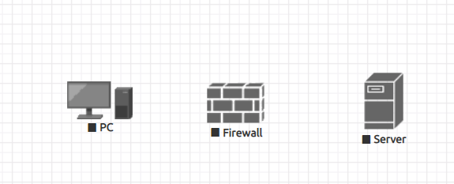

По итогу получилась следующая схема:

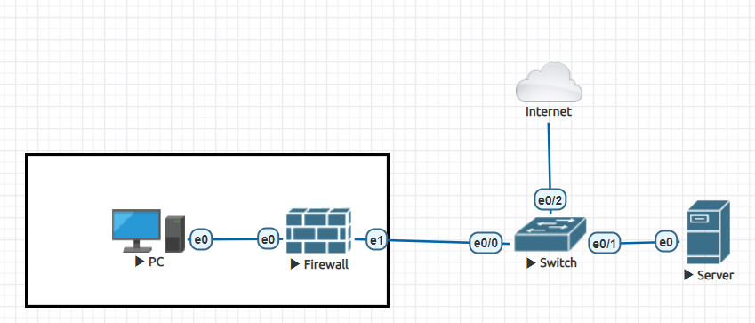

Для Ubuntu Server:
Логин: `root`
Пароль: `eve@123`

Для Kali (PC):
Логин: `root`
Пароль: `toor`

---

## Настройка сервера

### Смена шрифта консоли

```bash
cd /usr/share/consolefonts
setfont Uni3-TerminusBold22x11.psf.gz
```

### Замена имени компьютера на Linux

В двух файлах:

```bash
nano /etc/hostname
nano /etc/hosts
```

заменили `ubuntu` на `Web-server`

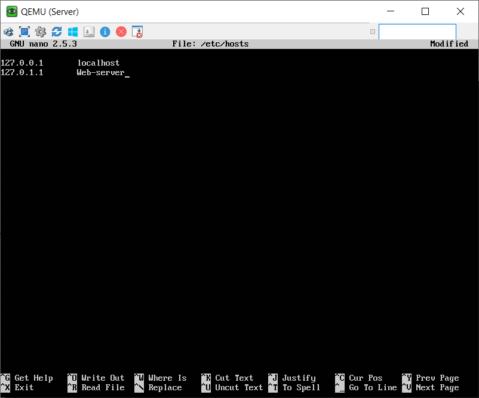

### Настройка интерфейсов, подключение к сети

`ip a` - для просмотра ip-адресов

Для настройки вводим:

```bash
nano /etc/network/interfaces
```

`auto eth0` - автоматическое поднятие интерфейса при начале работы

`allow-hotplug eth0`  - разрешение на переподключение при отсоединении

`iface eth0 inet dhcp` - параметры настройки интерфейсов

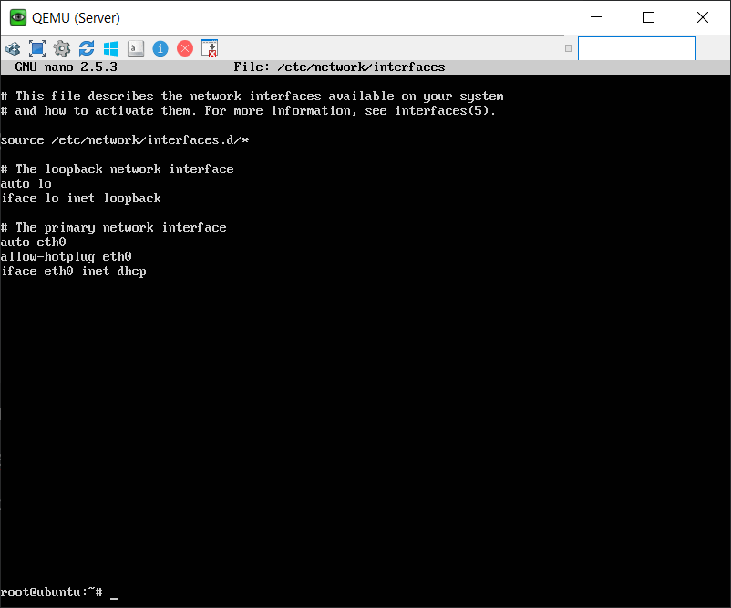

`reboot` - перезагрузка машины

После перезагрузки файрволл должен успешно пинговать 8.8.8.8, и имя должно быть изменено.

### Настройка ssh (в лабе необязательна)

Зайти в файл

```bash
nano /etc/ssh/sshd_config
```

и поставить `PermitRootLogin yes`

Теперь можно присоединяться к системе с другой консоли.

### Прописываем маршрут к сетке файрволла

```bash
ip route add 10.10.100.0/24 via 192.168.175.137
```

### Установка nginx (поднимаем веб-сервер)

```bash
apt-get update
apt install nginx
```

### Просмотр портов

```bash
ss -tunlp
```

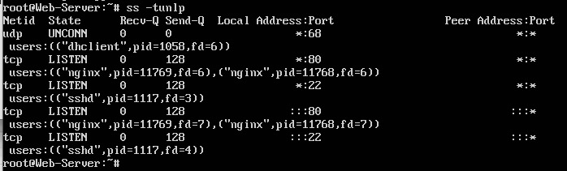

---

## Настройка файрволла

Настраиваем интерфейсы, [как и на сервере](/iptables.md#%D0%9D%D0%B0%D1%81%D1%82%D1%80%D0%BE%D0%B8%D0%BC-%D0%B8%D0%BD%D1%82%D0%B5%D1%80%D1%84%D0%B5%D0%B9%D1%81%D1%8B-%D0%B8-%D1%81%D0%B5%D1%82%D1%8C), только ещё добавить интерфейс для связи с PC.

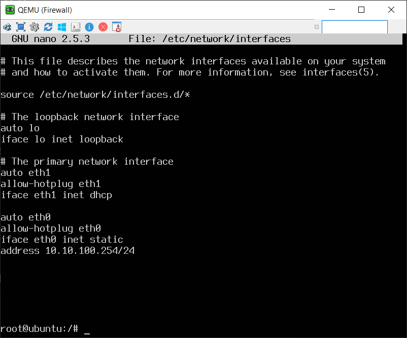

### Рестарт сети без перезагрузки машины

```bash
systemctl restart networking
```

После перезагрузки:

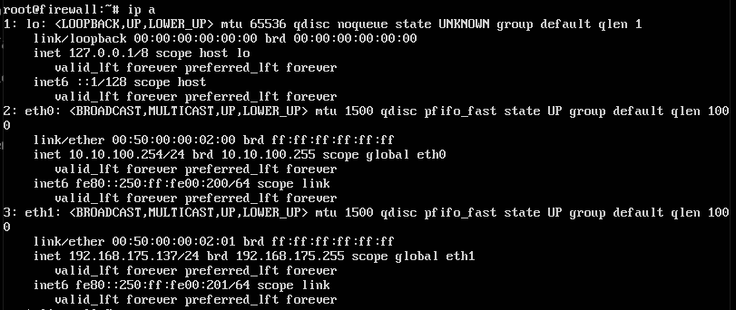

### Установка пакета для диагностики сети

```bash
apt update
apt install tcpdump
```

Применение:

```bash
tcpdump -i eth0
```

### Превращаем Linux в роутер (настройка kernel options)

В файле

```bash
nano /etc/sysctl.conf
```

раскоменчиваем строку

```bash
net.ipv4.ip_forward=1
```

и активируем

```bash
sysctl -
```

### Прописываем правила в iptables

Текущая iptables:

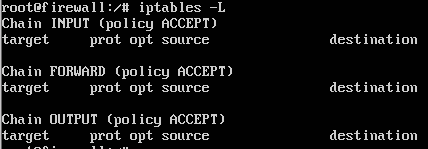

Разрешим подключаться к firewall по ssh:

```bash
iptables -A INPUT -p tcp --dport 22  -d 192.168.175.137 -j ACCEPT
```

**В iptables приоритетнее правило то, которое выше.**

Разрешаем трафик на веб-сервер к 80 порту а всё остальное запрещаем:

```bash
iptables -A FORWARD -d 192.168.175.136 -p tcp --dport 80 -j ACCEPT
iptables -A FORWARD -d 192.168.175.136 -j DROP
```

Пример удаления ошибочно добавленного правила в iptables:

```bash
iptables -t filter -D FORWARD -d 192.168.175.136 -j ACCEPT
```

В итоге должно получится так (можно обойтись без INPUT правила):

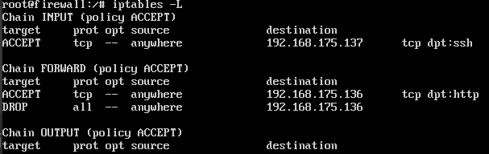

---

## Настройка в PC

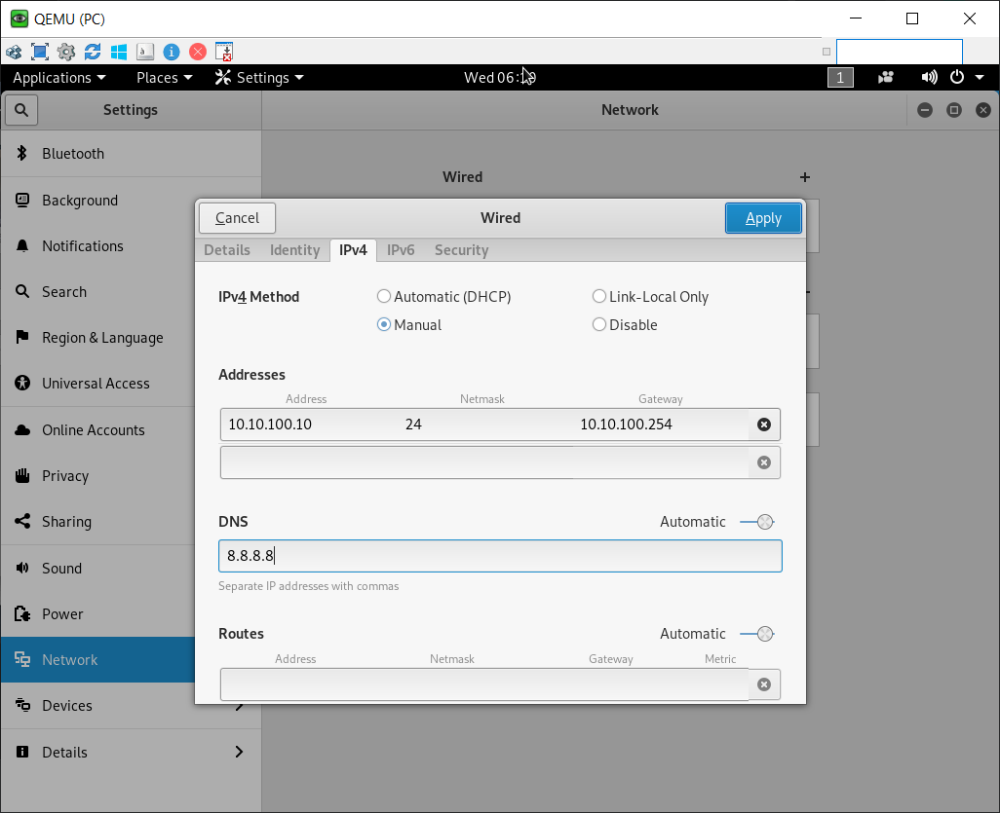

После этого необходимо внести небольшие правки в iptables и всё заработает!