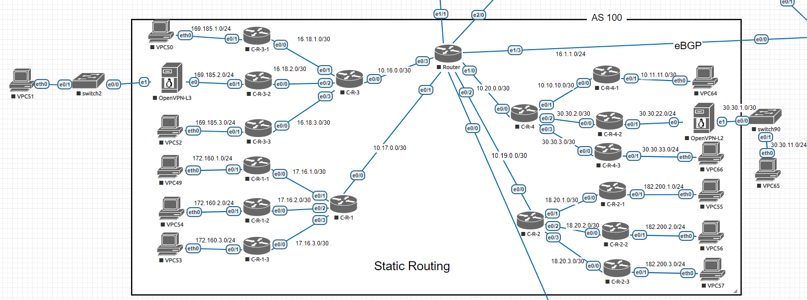

# Лабораторная работа №2  - Статическая маршрутизация

* [Все лабораторные работы по сетям и системам передачи данных](./README.md)
* [Предыдущая лабораторная работа - VLAN, DHCP](./VLAN,%20DHCP.md)
* [Следующая лабораторная работа - Динамическая маршрутизация. Протоколы RIP и OSPF](./RIP,%20OSPF.md)

---

**Маршрутизация** (англ. Routing) — процесс определения маршрута данных в сетях связи. Маршруты могут задаваться административно - статические маршруты, либо вычисляться с помощью алгоритмов маршрутизации, базируясь на информации о топологии и состоянии сети, полученной с помощью протоколов маршрутизации - динамические маршруты (о них речь пойдёт в [Лабороторной №3](RIP,%20OSPF.md) ([RIP](RIP,%20OSPF.md#RIP), [OSPF](RIP,%20OSPF.md#OSPF)) и [Лабораторной №4](BGP.md) ([BGP](BGP.md)))

Шаблон прописывания статического маршрута на роутере [CISCO](https://www.cisco.com/).

```
ip route <distanation ip> <mask> <gateway>
```

При быстрого вычисления маски подсети может пригодиться [ip-калькулятор](https://ip-calculator.ru/).

Пример настройки статической маршрутизации в лабораторной работе для маршрутизатора C-R-4



```
ip route 0.0.0.0 0.0.0.0 10.20.0.2
ip route 10.0.0.0 255.255.0.0 10.20.0.2
ip route 10.11.11.0 255.255.255.252 10.10.10.1
ip route 10.16.0.0 255.255.255.252 10.20.0.2
ip route 10.17.0.0 255.255.255.252 10.20.0.2
ip route 10.19.0.0 255.255.255.252 10.20.0.2
ip route 16.18.0.0 255.255.252.0 10.20.0.2
ip route 17.16.0.0 255.255.252.0 10.20.0.2
ip route 18.20.0.0 255.255.252.0 10.20.0.2
ip route 30.30.22.0 255.255.255.0 30.30.2.1
ip route 30.30.33.0 255.255.255.0 30.30.3.1
ip route 169.185.0.0 255.255.252.0 10.20.0.2
ip route 172.160.0.0 255.255.255.0 10.20.0.2
ip route 182.200.0.0 255.255.252.0 10.20.0.2
```

Первая строка скрипта обозначает маршрут по умолчанию (так называемый default gateway).
